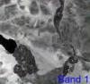
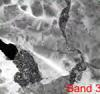
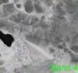
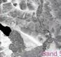
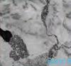
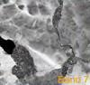

# Landsat 5 and 7 Bands

## Band 1

### B01 (blue)

- Resolution = 30 m/px
- Bandwidth = 0.433–0.453 µm

Use: scattered by the atmosphere and illuminates material in shadows better than longer wavelengths; penetrates clear water better than other colors; absorbed by chlorophyll, so plants don’t show up very brightly in this band; useful for soil/vegetation discrimination, forest type mapping, and identifying man-made features.

Custom script: ** return [B01];**

## Band 2

### B02 (green)

- Resolution = 30 m/px
- Bandwidth = 0.525-0.605 µm

Use: penetrates clear water fairly well, gives excellent contrast between clear and turbid (muddy) water; helps find oil on the surface of water, and vegetation (plant life); reflects more green light than any other visible color; man-made features are still visible.

Custom script: ** return [B02];**

## Band 3

### B03 (red)

- Resolution = 30 m/px
- Bandwidth = 0.63-0.69 µm

Use: limited water penetration; reflects well from dead foliage, but not well from live foliage with chlorophyll; useful for identifying vegetation types, soils, and urban (city and town) features.

Custom script: ** return [B03];**

## Band 4

### B04 (NIR)

- Resolution = 30 m/px
- Bandwidth = 0.75-0.90 µm

Use: good for mapping shorelines and biomass content; very good at detecting and analyzing vegetation.

Custom script: ** return [B04];**

## Band 5

### B05 (SWIR)

- Resolution = 30 m/px
- Bandwidth = 1.55-1.75 µm

Use: limited cloud penetration; provides good contrast between different types of vegetation; useful for measuring the moisture content of soil and vegetation; helps differentiate between snow and clouds.

Custom script: ** return [B05];**

## Band 6

### B06 (TIR or LWIR)

- Resolution = 60 / 120 m/px*
- Bandwidth = 10.4-12.5 µm

Use: useful to observe temperature and its effects, such as daily and seasonal variations; useful to identify some vegetation density, moisture, and cover type.

Custom script: ** return [B06];**

## Band 7

### B07 (SWIR 2)

- Resolution = 30 m/px
- Bandwidth = 2.09-2.35 µm

Use: limited cloud penetration; provides good contrast between different types of vegetation; useful for measuring the moisture content of soil and vegetation; helps differentiate between snow and clouds.

Custom script: ** return [B07];**

## Band 8

### B08 (Panchromatic - “pan”)

- Resolution = 15 m/px
- Bandwidth = 0.52-0.9 µm

Use: The near infrared band is good for mapping shorelines and biomass content, as well as at detecting and analyzing vegetation.

Custom script: ** return [B08];**

