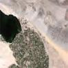
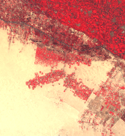

# Simple RGB Composites (Landsat 5 and 7)

## True Color

### RGB (3, 2, 1)

True color composite uses visible light bands red (B04), green (B03) and blue (B02) in the corresponding red, green and blue color channels, resulting in a natural colored result, that is a good representation of the Earth as humans would see it naturally.

Custom script: **return [B03, B02, B01];

 - [Reference](https://www.usgs.gov/land-resources/nli/landsat/landsat-5?qt-science_support_page_related_con=0#qt-science_support_page_related_con)

## False Color

### RGB (4,3,1)

False color composite using near infrared, red and green bands is very popular. It is most commonly used to assess plant density and healht, as plants reflect near infrared and green light, while absorbing red. Since they reflect more near infrared than green, plant-covered land appears deep red. Denser plant growth is darker red. Cities and exposed ground are gray or tan, and water appears blue or black.

Custom script: **return [B04, B03, B02];

 - [Reference](https://earthobservatory.nasa.gov/features/FalseColor)
 
 NIR (Near Infra-red, band 5)

## Near Infra-red

### NIR (2,3,4)

In this image, band 2 is displayed in blue, band 3 is displayed in green, and band 4 is displayed in red. This rendition looks rather strange - vegetation jumps out as a bright red because green vegetation readily reflects infrared light energy! It is similar to pictures taken from aircraft when using infrared film; very useful for studying vegetation.

Custom script: **return [B02, B03, B04];

## Short-wave Infrared

### RGB (7,5,4)

In this SWIR image, band 2 is displayed in blue, band 4 is displayed in green, and band 7 (or 5) is displayed in red. This rendition looks like a jazzed up true color rendition - one with more striking colors.aking them valuable for mapping fire damage.

Custom script: **return [B07, B05, B04];

