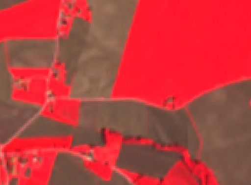

# False color infrared product, SPOT data

<a href="#" id='togglescript'>Show</a> script or [download](script.js){:target="_blank"} it.


      


## Evaluate and visualize

As Airbus SPOT is commercial data, brought into Sentinel Hub as Bring Your Own Data, direct EO Browser and Sentinel Playgorund links are not possible due to the personalized data credentials. 

## General description

The [False color](https://en.wikipedia.org/wiki/False_color) infrared composite maps near-infrared spectral band B3 with red and green bands, B2 and B1, to [sRGB](https://en.wikipedia.org/wiki/SRGB) components directly. It is most commonly used to assess plant density and healht, as plants reflect near infrared and green light, while absorbing red. Since they reflect more near infrared than green, plant-covered land appears deep red. Denser plant growth is darker red. Cities and exposed ground are gray or tan, and water appears blue or black.

## Description of representative images

False color composite of Zgornje Konjišče, Slovenia. 

## References
- [1] Wikipedia, [False color](https://en.wikipedia.org/wiki/False_color). Accessed October 10th 2017.
- [2] Wikipedia, [sRGB](https://en.wikipedia.org/wiki/SRGB). Accessed October 10th 2017.
