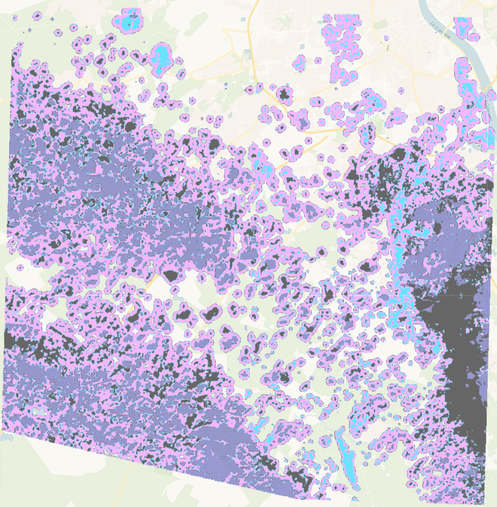

## General description
Analysis-Ready PlanetScope has several classifications within QA Band 1, “Cloud and shadow mask”. A value of 1 is clear, meaning that the surface is clearly visible. If it’s not clear, that means it’s classified as having some other type of contamination. In the script, each of the non-clear pixels in QA Band 1 are classified with a unique color, and the pixels that are clear are returned transparent.

## Description of representative image

A visualization of different classes of clouds for Bordeaux, France (April 2023)

