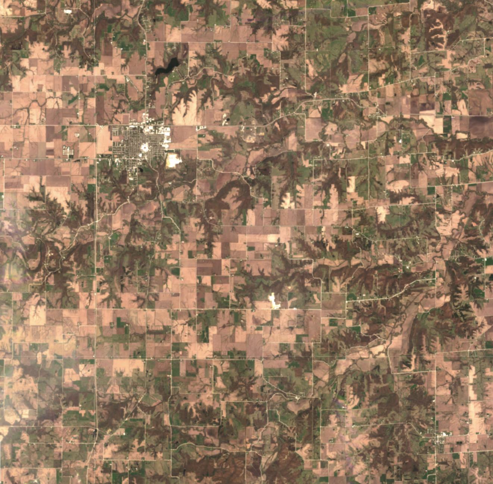

## General description
The true color product maps Analysis-Ready PlanetScope band values red, green, and blue which roughly correspond to red, green, and blue part of the spectrum, respectively, to R, G, and B components.

## Description of representative image

A true color visualization of Des Moines, United States (April 2023)

