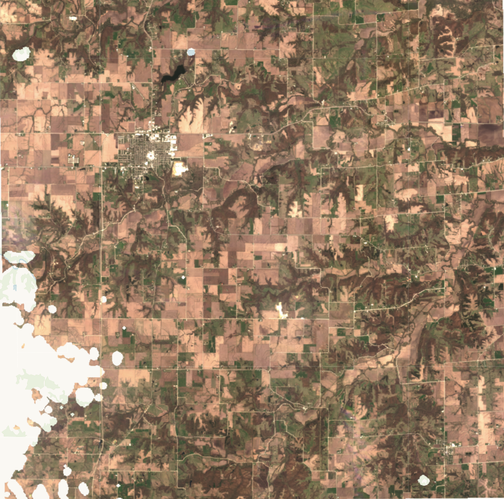

## General description
The first QA Band, Cloud and shadow mask band gives information on whether the pixel is clear, meaning that the surface is clearly visible. If it’s not clear, that means it’s classified as either bright cloud, shadow, haze, adjacent clouds, additional cloud shadow or haze, or other. The script masks out all pixels where band QA1 does not have a value of 1 or “clear”. The resulting image has values of zero set for all four surface reflectance bands where clouds, cloud contamination, shadows, snow, etc. have been detected.

## Description of representative image

A true color visualization with clouds masked out for Des Moines, United States (April 2023)

