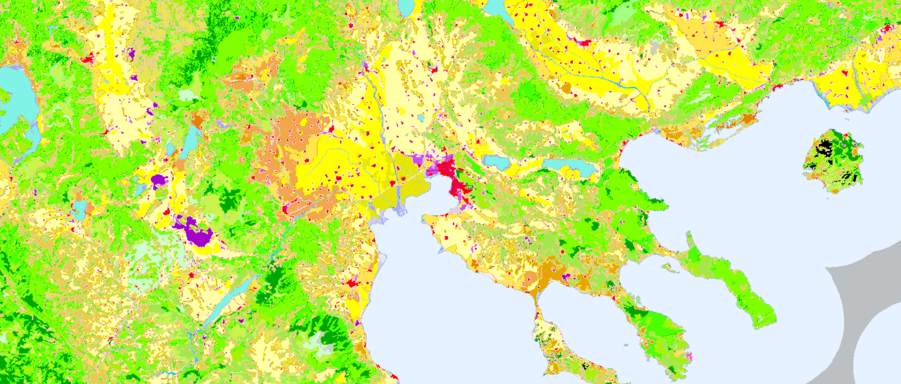
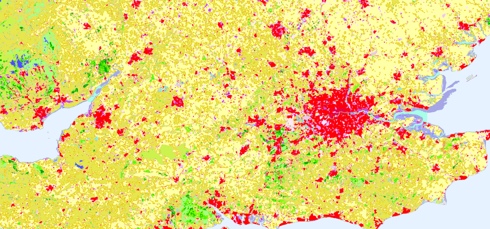

# CORINE Land Cover Accounting Layers visualisation script

<a href="#" id='togglescript'>Show</a> script or [download](script.js){:target="_blank"} it.


      


## General description

This script visualises CORINE Land Cover (CLC) Accounting Layers according to the official CORINE Land Cover color scheme. [CLC Accounting Layers](https://www.eea.europa.eu/data-and-maps/data/corine-land-cover-accounting-layers) are CLC status layers modified for the purpose of consistent statistical analysis in the land cover change accounting system at EEA.  

For more details about the classes, please see the official [CORINE Land Cover nomenclature guidelines](https://land.copernicus.eu/user-corner/technical-library/corine-land-cover-nomenclature-guidelines/html/index.html) or the illustrated [nomenclature guidelines document](https://land.copernicus.eu/user-corner/technical-library/corine-land-cover-nomenclature-guidelines/docs/pdf/CLC2018_Nomenclature_illustrated_guide_20190510.pdf).

Table 1: CORINE Land Cover nomenclature and colouring scheme.

<table>
  <thead>
    <tr>
      <th>Value</th>
      <th>Color</th>
      <th>Label</th>
    </tr>
  </thead>
  <tbody>
    <tr>
      <td>111</td>
      <td style="background-color: #e6004d;"></td>
      <td>111 - Continuous urban fabric</td>
    </tr>
    <tr>
      <td>112</td>
      <td style="background-color: #ff0000;"></td>
      <td>112 - Discontinuous urban fabric</td>
    </tr>
    <tr>
      <td>121</td>
      <td style="background-color: #cc4df2;"></td>
      <td>121 - Industrial or commercial units</td>
    </tr>
    <tr>
      <td>122</td>
      <td style="background-color: #cc0000;"></td>
      <td>122 - Road and rail networks and associated land</td>
    </tr>
    <tr>
      <td>123</td>
      <td style="background-color: #e6cccc;"></td>
      <td>123 - Port areas</td>
    </tr>
    <tr>
      <td>124</td>
      <td style="background-color: #e6cce6;"></td>
      <td>124 - Airports</td>
    </tr>
    <tr>
      <td>131</td>
      <td style="background-color: #a600cc;"></td>
      <td>131 - Mineral extraction sites</td>
    </tr>
    <tr>
      <td>132</td>
      <td style="background-color: #a64d00;"></td>
      <td>132 - Dump sites</td>
    </tr>
    <tr>
      <td>133</td>
      <td style="background-color: #ff4dff;"></td>
      <td>133 - Construction sites</td>
    </tr>
    <tr>
      <td>141</td>
      <td style="background-color: #ffa6ff;"></td>
      <td>141 - Green urban areas</td>
    </tr>
    <tr>
      <td>142</td>
      <td style="background-color: #ffe6ff;"></td>
      <td>142 - Sport and leisure facilities</td>
    </tr>
    <tr>
      <td>211</td>
      <td style="background-color: #ffffa8;"></td>
      <td>211 - Non-irrigated arable land</td>
    </tr>
    <tr>
      <td>212</td>
      <td style="background-color: #ffff00;"></td>
      <td>212 - Permanently irrigated land</td>
    </tr>
    <tr>
      <td>213</td>
      <td style="background-color: #e6e600;"></td>
      <td>213 - Rice fields</td>
    </tr>
    <tr>
      <td>221</td>
      <td style="background-color: #e68000;"></td>
      <td>221 - Vineyards</td>
    </tr>
    <tr>
      <td>222</td>
      <td style="background-color: #f2a64d;"></td>
      <td>222 - Fruit trees and berry plantations</td>
    </tr>
    <tr>
      <td>223</td>
      <td style="background-color: #e6a600;"></td>
      <td>223 - Olive groves</td>
    </tr>
    <tr>
      <td>231</td>
      <td style="background-color: #e6e64d;"></td>
      <td>231 - Pastures</td>
    </tr>
    <tr>
      <td>241</td>
      <td style="background-color: #ffe6a6;"></td>
      <td>241 - Annual crops associated with permanent crops</td>
    </tr>
    <tr>
      <td>242</td>
      <td style="background-color: #ffe64d;"></td>
      <td>242 - Complex cultivation patterns</td>
    </tr>
    <tr>
      <td>243</td>
      <td style="background-color: #e6cc4d;"></td>
      <td>243 - Land principally occupied by agriculture with significant areas of natural vegetation</td>
    </tr>
    <tr>
      <td>244</td>
      <td style="background-color: #f2cca6;"></td>
      <td>244 - Agro-forestry areas</td>
    </tr>
    <tr>
      <td>311</td>
      <td style="background-color: #80ff00;"></td>
      <td>311 - Broad-leaved forest</td>
    </tr>
    <tr>
      <td>312</td>
      <td style="background-color: #00a600;"></td>
      <td>312 - Coniferous forest</td>
    </tr>
    <tr>
      <td>25</td>
      <td style="background-color: #4dff00;"></td>
      <td>313 - Mixed forest</td>
    </tr>
    <tr>
      <td>321</td>
      <td style="background-color: #ccf24d;"></td>
      <td>321 - Natural grasslands</td>
    </tr>
    <tr>
      <td>322</td>
      <td style="background-color: #a6ff80;"></td>
      <td>322 - Moors and heathland</td>
    </tr>
    <tr>
      <td>323</td>
      <td style="background-color: #a6e64d;"></td>
      <td>323 - Sclerophyllous vegetation</td>
    </tr>
    <tr>
      <td>324</td>
      <td style="background-color: #a6f200;"></td>
      <td>324 - Transitional woodland-shrub</td>
    </tr>
    <tr>
      <td>331</td>
      <td style="background-color: #e6e6e6;"></td>
      <td>331 - Beaches - dunes - sands</td>
    </tr>
    <tr>
      <td>332</td>
      <td style="background-color: #cccccc;"></td>
      <td>332 - Bare rocks</td>
    </tr>
    <tr>
      <td>333</td>
      <td style="background-color: #ccffcc;"></td>
      <td>333 - Sparsely vegetated areas</td>
    </tr>
    <tr>
      <td>334</td>
      <td style="background-color: #000000;"></td>
      <td>334 - Burnt areas</td>
    </tr>
    <tr>
      <td>335</td>
      <td style="background-color: #a6e6cc;"></td>
      <td>335 - Glaciers and perpetual snow</td>
    </tr>
    <tr>
      <td>411</td>
      <td style="background-color: #a6a6ff;"></td>
      <td>411 - Inland marshes</td>
    </tr>
    <tr>
      <td>412</td>
      <td style="background-color: #4d4dff;"></td>
      <td>412 - Peat bogs</td>
    </tr>
    <tr>
      <td>421</td>
      <td style="background-color: #ccccff;"></td>
      <td>421 - Salt marshes</td>
    </tr>
    <tr>
      <td>422</td>
      <td style="background-color: #e6e6ff;"></td>
      <td>422 - Salines</td>
    </tr>
    <tr>
      <td>423</td>
      <td style="background-color: #a6a6e6;"></td>
      <td>423 - Intertidal flats</td>
    </tr>
    <tr>
      <td>511</td>
      <td style="background-color: #00ccf2;"></td>
      <td>511 - Water courses</td>
    </tr>
    <tr>
      <td>512</td>
      <td style="background-color: #80f2e6;"></td>
      <td>512 - Water bodies</td>
    </tr>
    <tr>
      <td>521</td>
      <td style="background-color: #00ffa6;"></td>
      <td>521 - Coastal lagoons</td>
    </tr>
    <tr>
      <td>522</td>
      <td style="background-color: #a6ffe6;"></td>
      <td>522 - Estuaries</td>
    </tr>
    <tr>
      <td>523</td>
      <td style="background-color: #e6f2ff;"></td>
      <td>523 - Sea and ocean</td>
    </tr>
    <tr>
      <td>999</td>
      <td style="background-color: #ffffff;"></td>
      <td>999 - NODATA</td>
    </tr>
  </tbody>
</table>

## Description of representative images

*CORINE Land Cover Accounting Layers, Thessaloniki Greece visualised on EO Browser.*

*CORINE Land Cover Accounting Layers, London England visualised on EO Browser.*

## Resources

- [Data source](https://www.eea.europa.eu/data-and-maps/data/corine-land-cover-accounting-layers) 

- [Product User manual](https://land.copernicus.eu/user-corner/technical-library/clc-product-user-manual)

- [Entry in public collections](https://collections.sentinel-hub.com/corine-land-cover-accounting-layers/)

