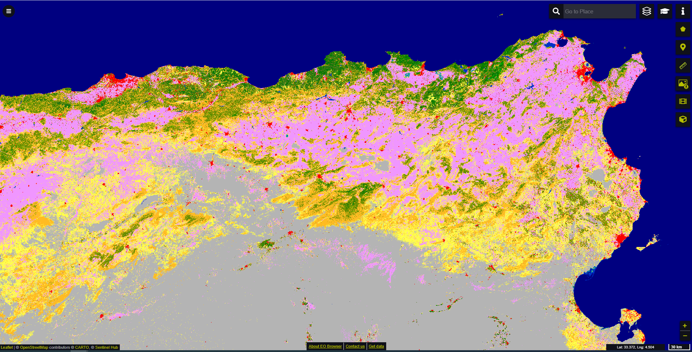
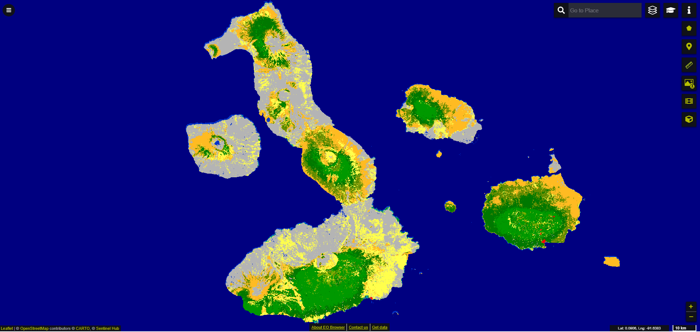

# Global Land Cover discrete classification map  visualisation script

<a href="#" id='togglescript'>Show</a> script or [download](script.js){:target="_blank"} it.


      


## General description of the script  
This script visualises Global Land Cover discrete classification map with classes defined using the UN-FAO Land Cover Classification System (LCCS) and with color scheme defined in the [Product User Manual](https://land.copernicus.eu/global/sites/cgls.vito.be/files/products/CGLOPS1_PUM_LC100m-V3_I3.3.pdf).  

Table 1: Color legend for the 23 discrete classes of land cover classification map 
<table>
  <thead>
    <tr>
      <th>Value</th>
      <th>Color</th>
	    <th>Label</th>
    </tr>
  </thead>
  <tbody>
    <tr>
      <td>0 </td>
      <td style="background-color:#282828"></td>
	    <td> No input data available </td>
    </tr>
    <tr>
      <td>20</td>
      <td style="background-color:#ffbb22"></td>
	    <td> Shrubs </td>
    </tr>
    <tr>
      <td>30</td>
      <td style="background-color:#ffff4c"></td>
	    <td> Herbaceous vegetation </td>
    </tr>
    <tr>
      <td>40</td>
      <td style="background-color:#f096ff" ></td>
	    <td> Cultivated and managed vegetation/agriculture (cropland) </td>
    </tr>
    <tr>
      <td>50</td>
      <td style="background-color:#fa0000" ></td>
	    <td> Urban / built up </td>
    </tr>
    <tr>
      <td>60</td>
      <td style="background-color:#b4b4b4"></td>
	    <td> Bare / sparse vegetation </td>
    </tr>  
    <tr>
      <td>70</td>
      <td style="background-color:#f0f0f0"></td>
	    <td> Snow and Ice </td>
    </tr> 
    <tr>
      <td>80</td>
      <td style="background-color:#0032c8"></td>
	    <td> Permanent water bodies </td>
    </tr> 
    <tr>
      <td>90</td>
      <td style="background-color:#0096a0"></td>
	    <td> Herbaceous wetland </td>
    </tr>
    <tr>
      <td>100</td>
      <td style="background-color:#fae6a0"></td>
	    <td> Moss and lichen </td>
    </tr>
    <tr>
      <td>111</td>
      <td style="background-color:#58481f"></td>
	    <td> Closed forest, evergreen needle leaf </td>
    </tr>
    <tr>
      <td>112</td>
      <td style="background-color:#009900"></td>
	    <td> Closed forest, evergreen, broad leaf </td>
    </tr>
    <tr>
      <td>113</td>
      <td style="background-color:#70663e"></td>
	    <td> Closed forest, deciduous needle leaf </td>
    </tr>
    <tr>
      <td>114</td>
      <td style="background-color:#00cc00"></td>
	    <td> Closed forest, deciduous broad leaf </td>
    </tr>
    <tr>
      <td>115</td>
      <td style="background-color:#4e751f"></td>
	    <td> Closed forest, mixed </td>
    </tr>
    <tr>
      <td>116</td>
      <td style="background-color:#007800"></td>
	    <td> Closed forest, unknown </td>
    </tr>
    <tr>
      <td>121</td>
      <td style="background-color:#666000"></td>
	    <td> Open forest, evergreen needle leaf </td>
    </tr>
    <tr>
      <td>122</td>
      <td style="background-color:#8db400"></td>
	    <td> Open forest, evergreen broad leaf </td>
    </tr>
    <tr>
      <td>123</td>
      <td style="background-color:#8d7400"></td>
	    <td> Open forest, deciduous needle leaf </td>
    </tr>
    <tr>
      <td>124</td>
      <td style="background-color:#a0dc00"></td>
	    <td> Open forest, deciduous broad leaf </td>
    </tr>
      <tr>
      <td>125</td>
      <td style="background-color:#929900"></td>
	    <td> Open forest, mixed </td>
    </tr>
    <tr>
      <td>126</td>
      <td style="background-color:#648c00"></td>
	    <td> Open forest, unknown </td>
    </tr>
    <tr>
      <td>200</td>
      <td style="background-color:#000080"></td>
	    <td> Open sea </td>
    </tr>
    <tr>
      <td>255</td>
      <td></td>
	    <td> No data </td>
    </tr>
  </tbody>
</table>  

## Description of representative images
*2019 nrt discrete land cover classification map for parts of North Africa visualised in EO browser* 

  

*2019 nrt discrete land cover classification map for Republic of Ecuador's Galápagos Island visualised in EO browser*   

## Resources

- [Data source](https://lcviewer.vito.be/download)

- [Entry in public collections](https://github.com/sentinel-hub/public-collections/tree/main/collections/global-land-cover)
