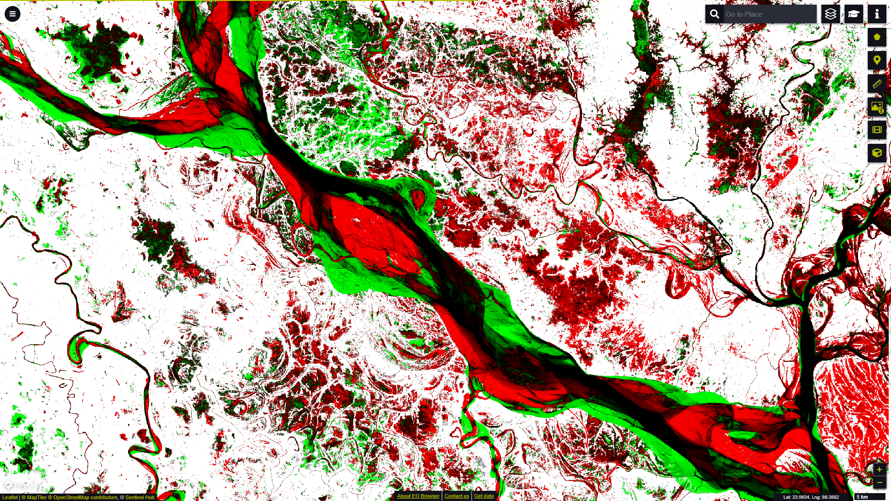

# Global Surface Water Occurrence Change Intensity visualisation script

<a href="#" id='togglescript'>Show</a> script or [download](script.js){:target="_blank"} it.


      


## General description of the script

This script visualizes the Occurrence Change Intensity layer from the Global Surface Water dataset according to the official symbology (Table 1). The Occurrence Change Intensity layer visualises changes in water occurrence between two different epochs, the first ranging from **March 1984 to December 1999**, and the other covering the period from **January 2000 to December 2019**.

Table 1: Occurrence Change Intensity Symbology

<table>
  <thead>
    <tr>
      <th>Value</th>
      <th>Symbol</th>
      <th>Colour</th>
      <th>Label</th>
    </tr>
  </thead>
  <tbody>
    <tr>
      <td>0</td>
      <td style="background-color:#FF0000"></td>
      <td>0xff0000</td>
      <td>-100% loss of occurrence</td>
    </tr>
    <tr>
      <td>100</td>
      <td style="background-color:#000000"></td>
      <td>0x000000</td>
      <td>No change</td>
    </tr>
    <tr>
      <td>200</td>
      <td style="background-color:#00FF00"></td>
      <td>0x00ff00</td>
      <td>100% increase in occurrence</td>
    </tr>
    <tr>
      <td>253</td>
      <td style="background-color:#FFFFFF"></td>
      <td>0xffffff</td>
      <td>Not water</td>
    </tr>
    <tr>
      <td>254</td>
      <td style="background-color:#888888"></td>
      <td>0x888888</td>
      <td>Unable to calculate a value due to no homologous months</td>
    </tr>
    <tr>
      <td>255</td>
      <td style="background-color:#CCCCCC"></td>
      <td>0xcccccc</td>
      <td>No data</td>
    </tr>
  </tbody>
</table>
 

## Description of representative images

*Occurrence Change Intensity layer visualisation in EO Browser for a section of the Padma River, the main distributary of the Ganges, in Bangladesh.*

## Resources

- [Data Source](https://global-surface-water.appspot.com/download)

- [Entry in public collections](https://collections.sentinel-hub.com/global-surface-water/)

- [Entry in public collections repository](https://github.com/sentinel-hub/public-collections/tree/main/collections/global-surface-water)
