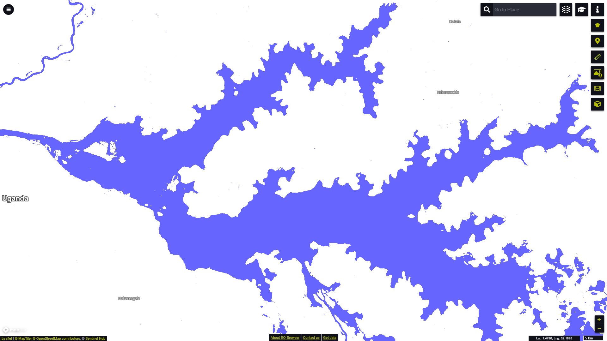

# Global Surface Water Extent visualisation script

<a href="#" id='togglescript'>Show</a> script or [download](script.js){:target="_blank"} it.


      


## General description of the script

This script visualizes the Extent layer from the Global Surface Water dataset according to the official symbology (Table 1). The maximum water Extent layer combines all other layers by visualising all locations for which water presence has ever been detected over the 36-year period.

Table 1: Extent Symbology

<table>
  <thead>
    <tr>
      <th>Value</th>
      <th>Symbol</th>
      <th>Colour</th>
      <th>Label</th>
    </tr>
  </thead>
  <tbody>
    <tr>
      <td>0</td>
      <td style="background-color:#FFFFFF"></td>
      <td>0xffffff</td>
      <td>Not water</td>
    </tr>
    <tr>
      <td>1</td>
      <td style="background-color:#6666FF"></td>
      <td>0x6666ff</td>
      <td>Water detected</td>
    </tr>
    <tr>
      <td>255</td>
      <td style="background-color:#CCCCCC"></td>
      <td>0xcccccc</td>
      <td>No data</td>
    </tr>
  </tbody>
</table>
 

## Description of representative images

*Extent layer visualisation in EO Browser capturing the maximum water extent for Lake Kyoga, Uganda.*

## Resources

- [Data Source](https://global-surface-water.appspot.com/download)

- [Entry in public collections](https://collections.sentinel-hub.com/global-surface-water/)

- [Entry in public collections repository](https://github.com/sentinel-hub/public-collections/tree/main/collections/global-surface-water)
