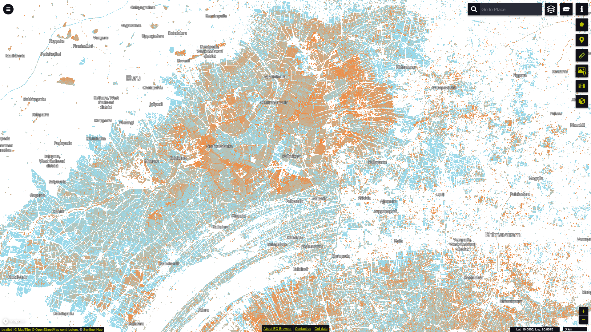

# Global Surface Water Recurrence visualisation script

<a href="#" id='togglescript'>Show</a> script or [download](script.js){:target="_blank"} it.


      


## General description of the script

This script visualizes the Recurrence layer from the Global Surface Water dataset according to the official symbology (Table 1). The Recurrence layer captures the degree of interannual variability in surface water presence. It shows how frequently water returned to a particular location between years in a defined water period within the period from 1984 to 2019.

Table 1: Recurrence Symbology

<table>
  <thead>
    <tr>
      <th>Value</th>
      <th>Symbol</th>
      <th>Colour</th>
      <th>Label</th>
    </tr>
  </thead>
  <tbody>
    <tr>
      <td>0</td>
      <td style="background-color:#FFFFFF"></td>
      <td>0xffffff</td>
      <td>Not water</td>
    </tr>
    <tr>
      <td>1</td>
      <td style="background-color:#FF7F27"></td>
      <td>0xff7f27</td>
      <td>1% recurrence</td>
    </tr>
    <tr>
      <td>100</td>
      <td style="background-color:#99D9EA"></td>
      <td>0x99d9ea</td>
      <td>100% recurrence</td>
    </tr>
    <tr>
      <td>255</td>
      <td style="background-color:#CCCCCC"></td>
      <td>0xcccccc</td>
      <td>No data</td>
    </tr>
  </tbody>
</table>
 

## Description of representative images

*Recurrence layer visualisation in EO Browser showing Paddy fields near the city of Eluru in West Godavari, India.*

## Resources

- [Data Source](https://global-surface-water.appspot.com/download)

- [Entry in public collections](https://collections.sentinel-hub.com/global-surface-water/)

- [Entry in public collections repository](https://github.com/sentinel-hub/public-collections/tree/main/collections/global-surface-water)
