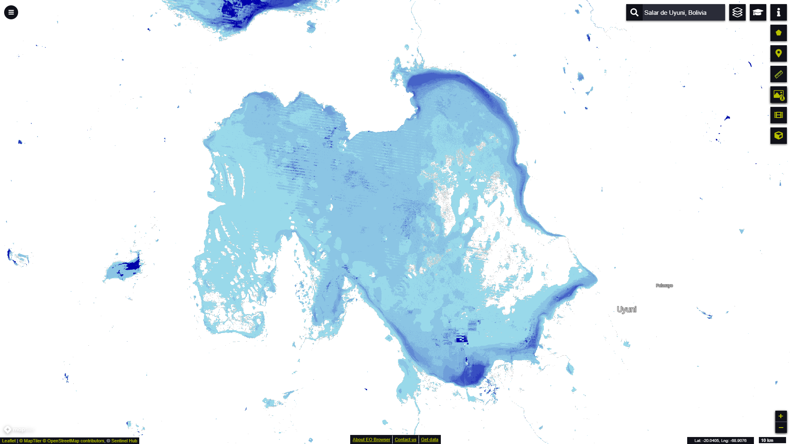

# Global Surface Water Seasonality visualisation script

<a href="#" id='togglescript'>Show</a> script or [download](script.js){:target="_blank"} it.


      


## General description of the script

This script visualizes the Seasonality layer from the Global Surface Water dataset according to the official symbology (Table 1). The Seasonality layer provides information on the intra-annual distribution of surface water in 2019.

Table 1: Seasonality Symbology

<table>
  <thead>
    <tr>
      <th>Value</th>
      <th>Symbol</th>
      <th>Colour</th>
      <th>Label</th>
    </tr>
  </thead>
  <tbody>
    <tr>
      <td>0</td>
      <td style="background-color:#FFFFFF"></td>
      <td>0xffffff</td>
      <td>Not water</td>
    </tr>
    <tr>
      <td>1</td>
      <td style="background-color:#99D9EA"></td>
      <td>0x99d9ea</td>
      <td>1 month of water</td>
    </tr>
    <tr>
      <td>12</td>
      <td style="background-color:#0000AA"></td>
      <td>0x0000aa</td>
      <td>12 months of water (permanent water)</td>
    </tr>
    <tr>
      <td>255</td>
      <td style="background-color:#CCCCCC"></td>
      <td>0xcccccc</td>
      <td>No data</td>
    </tr>
  </tbody>
</table>
 

## Description of representative images

*Eo Browser visualisation of surface water Seasonality in the world's largest salt flat Salar de Uyuni in southwest Bolivia.*

## Resources

- [Data Source](https://global-surface-water.appspot.com/download)

- [Entry in public collections](https://collections.sentinel-hub.com/global-surface-water/)

- [Entry in public collections repository](https://github.com/sentinel-hub/public-collections/tree/main/collections/global-surface-water)
