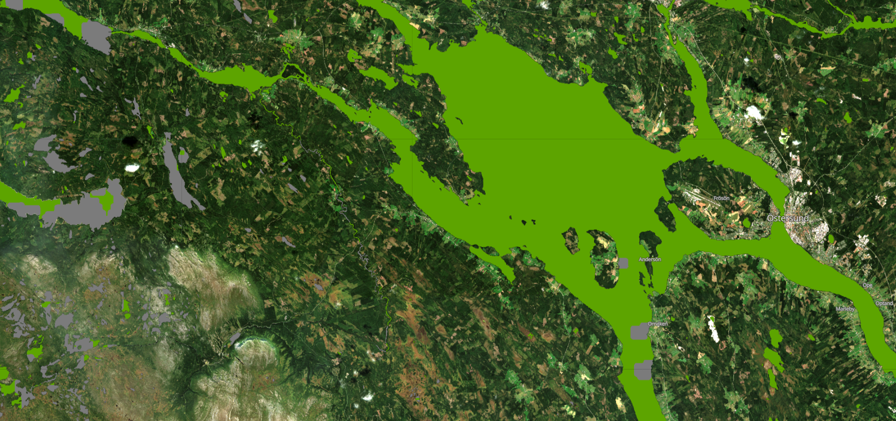

# CLMS HR-S&I: Sentinel-2 River and Lake Ice Extent quality layer visualisation script

<a href="#" id='togglescript'>Show</a> script or [download](script.js){:target="_blank"} it.





## General description of the script
This script visualises the Sentinel 2-based River and Lake Ice Extent quality layer.

Table 1: Classification classes and colouring scheme.

<table>
      <thead>
    <tr>
      <th>Value</th>
      <th>Color</th>
      <th>Label</th>
    </tr>
  </thead>
  <tbody>
    <tr>
      <td>0</td>
      <td style="background-color: #5DA400;"></td>
      <td>high quality</td>
    </tr>
    <tr>
      <td>1</td>
      <td style="background-color: #BDBD5B;"></td>
      <td>medium quality</td>
    </tr>
    <tr>
      <td>2</td>
      <td style="background-color: #FFC000;"></td>
      <td>low quality</td>
    </tr>
        <tr>
      <td>3</td>
      <td style="background-color: #FF0000;"></td>
      <td>minimal quality</td>
    </tr>
    <tr>
      <td>205</td>
      <td style="background-color: #7B7B7B;"></td>
      <td>cloud or cloud shadow</td>
    </tr>
    <tr>
      <td>255</td>
      <td style="background-color: #FFFFFF;"></td>
      <td>no data</td>
    </tr>
</tbody>
</table>

## Description of representative images

*31th July 2022, Östersund, SE*

## Resources

<<<<<<< HEAD
- [Data source](https://land.copernicus.eu/pan-european/biophysical-parameters/high-resolution-snow-and-ice-monitoring/ice-products/ice-cover)
=======
- [Data source]([Ice cover — Copernicus Land Monitoring Service](https://land.copernicus.eu/pan-european/biophysical-parameters/high-resolution-snow-and-ice-monitoring/ice-products/ice-cover))
>>>>>>> 74c9fce8b77f05ef51f35d77a14a116b0b8974f0
