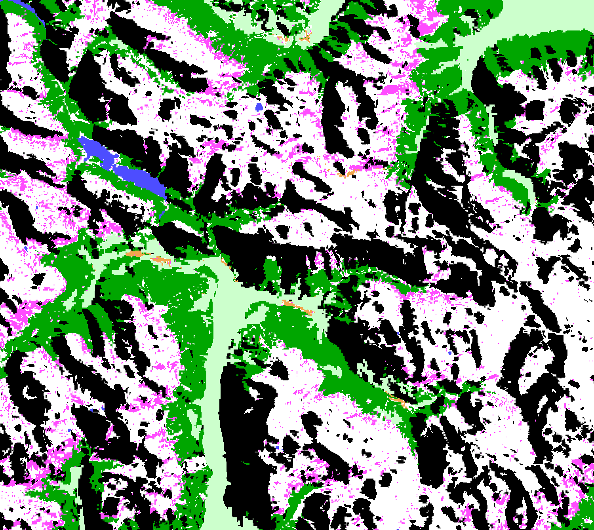

# CLMS HR-S&I: SAR Wet Snow in high mountains - Wet Snow classification in high Mountains areas visualisation script

<a href="#" id='togglescript'>Show</a> script or [download](script.js){:target="_blank"} it.


      


## General description of the script  
This script visualises SAR Wet Snow in high mountains - Wet Snow classification in high Mountains areas (SWS WSM).

Table 1: Classification classes and colouring scheme.

<table>
  <thead>
    <tr>
      <th>Value</th>
      <th>Color</th>
      <th>Label</th>
    </tr>
  </thead>
  <tbody>
    <tr>
      <td>1</td>
      <td style="background-color: #ff4dff;"></td>
      <td>110 - Wet snow</td>
    </tr>
    <tr>
      <td>2</td>
      <td style="background-color: #ffffff;"></td>
      <td>125 - Dry snow or snow free or patchy snow</td>
    </tr>
    <tr>
      <td>3</td>
      <td style="background-color: #000000;"></td>
      <td>200 - Radar shadow / layover / foreshortening</td>
    </tr>
    <tr>
      <td>4</td>
      <td style="background-color: #4d4dff;"></td>
      <td>210 - Water</td>
    </tr>
    <tr>
      <td>5</td>
      <td style="background-color: #00a600;"></td>
      <td>220 - Forest</td>
    </tr>
    <tr>
      <td>6</td>
      <td style="background-color: #f2a64d;"></td>
      <td>230 - Urban area</td>
    </tr>
      <tr>
      <td>6</td>
      <td style="background-color: #ccffcc;"></td>
      <td>230 - Non-mountain areas</td>
    </tr>
      <tr>
      <td>6</td>
      <td style="background-color: #ff0000;"></td>
      <td>230 - No data</td>
    </tr>
</tbody>
</table>

  
## Description of representative images
*16th March 2021, Bormio, IT* 

  

## Resources

- [Data source](https://land.copernicus.eu/pan-european/biophysical-parameters/high-resolution-snow-and-ice-monitoring/snow-products)

- Entry in public collections
