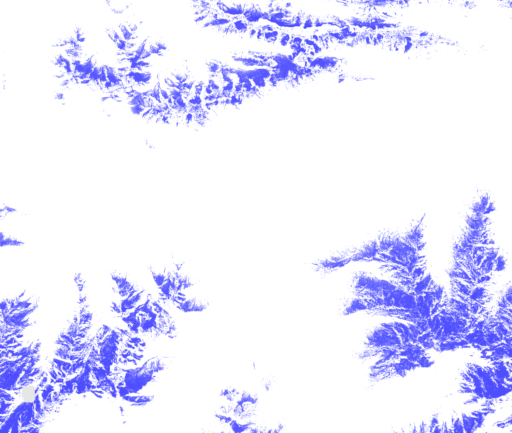

## General description of the script  
This script visualises Fractional Snow Cover NDSI. The product provides the NDSI values in the detected snow area, i.e. area where
FSCTOC > 0%.

  
## Description of representative images
*23rd April 2020, Innsbruck, AT* 

  

## Resources

- [Data source](https://land.copernicus.eu/pan-european/biophysical-parameters/high-resolution-snow-and-ice-monitoring/snow-products)