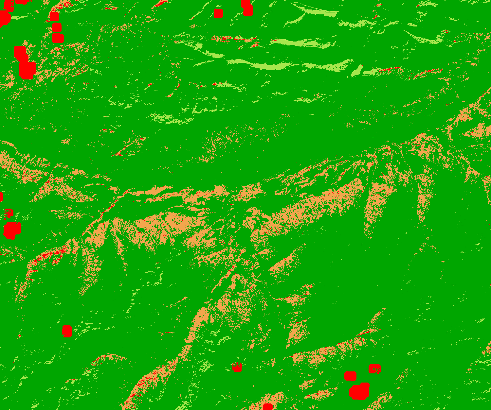

## General description of the script  
This script visualises the Fractional Snow Cover - On-ground fractional snow cover (%) quality layer

Table 1: Classification classes and colouring scheme.

<table>
  <thead>
    <tr>
      <th>Value</th>
      <th>Color</th>
      <th>Label</th>
    </tr>
  </thead>
  <tbody>
    <tr>
      <td>1</td>
      <td style="background-color: #00a600;"></td>
      <td>0 - high quality</td>
    </tr>
    <tr>
      <td>2</td>
      <td style="background-color: #a6e64d;"></td>
      <td>1 - medium quality</td>
    </tr>
    <tr>
      <td>3</td>
      <td style="background-color: #f2a64d;"></td>
      <td>2 - low quality</td>
    </tr>
    <tr>
      <td>4</td>
      <td style="background-color: #ff0000;"></td>
      <td>3 - minimal quality</td>
    </tr>
    <tr>
      <td>5</td>
      <td style="background-color: #cccccc;"></td>
      <td>200 - masked</td>
    </tr>
    <tr>
      <td>6</td>
      <td style="background-color: #000000;"></td>
      <td>255 - no data</td>
    </tr>
</tbody>
</table>  

## Description of representative images
*23rd April 2020, Innsbruck, AT* 

  

## Resources

- [Data source](https://land.copernicus.eu/pan-european/biophysical-parameters/high-resolution-snow-and-ice-monitoring/snow-products)
