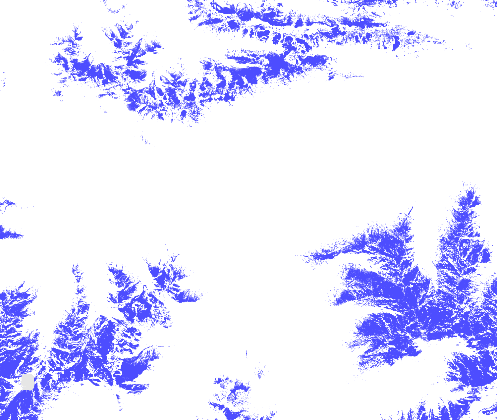

# CLMS HR-S&I: Fractional Snow Cover - Top of canopy fractional snow cover (%) visualisation script


<button class="btn btn-primary" id="toggle-script" onclick="toggleScript()">Show Script</button>
[Download Script](script.js){: .btn target="_blank" download="{{paths | append: ".js"}}"}
{: .mt-lg-4 }

 




## General description of the script  
This script visualises Fractional Snow Cover - Top of canopy fractional snow cover(%) (FSCTOC).

  
## Description of representative images
*23rd April 2020, Innsbruck, AT* 

  

## Resources

- [Data source](https://land.copernicus.eu/pan-european/biophysical-parameters/high-resolution-snow-and-ice-monitoring/snow-products)

