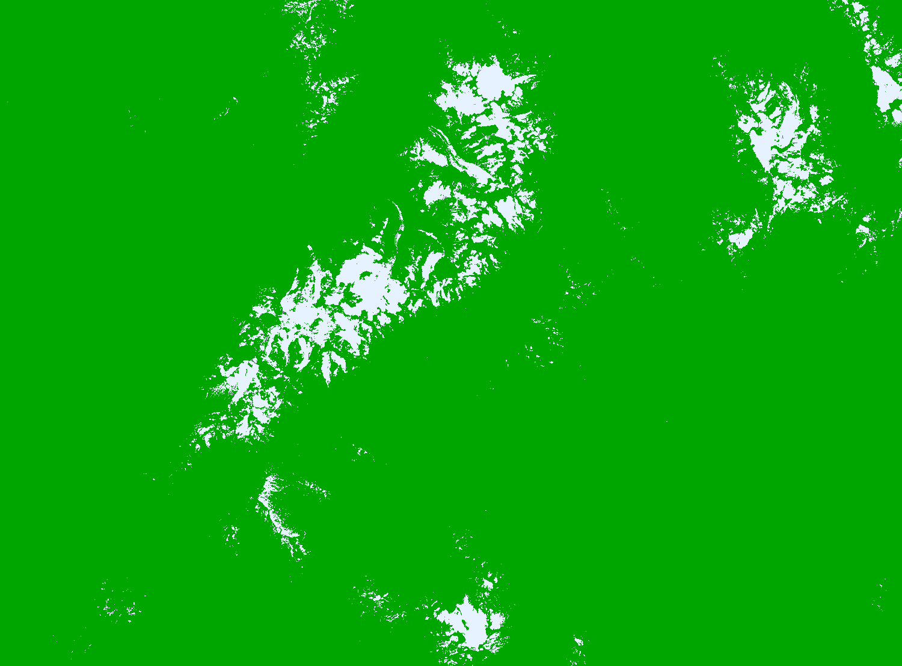

## General description of the script  
This script visualises Persistent Snow Area. 

Possible values
are as follows:
- 0: no persistent snow
- 1: persistent snow
- 255: no data

  
## Description of representative images
*PSA over the Mont Blanc Region, FR* 

  

## Resources

- [Data source](https://land.copernicus.eu/pan-european/biophysical-parameters/high-resolution-snow-and-ice-monitoring/snow-products)
