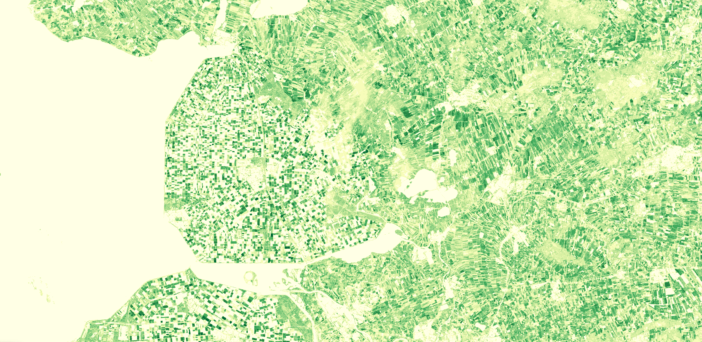

# VI LAI visualisation script


<button class="btn btn-primary" id="toggle-script" onclick="toggleScript()">Show Script</button>
[Download Script](script.js){: .btn target="_blank" download="{{paths | append: ".js"}}"}
{: .mt-lg-4 }

 




## General description of the script  
This script visualises raw LAI of the VI product. LAI is defined as one half of the total  area of photosynthetically active elements of the canopy per unit horizontal ground area. The LAI provided by HRVPP corresponds to actual LAI of all the canopy layers, including all green contributors. Practically, the LAI quantifies the thickness of the vegetation cover.
Physical values range from 0 to 8.The color map is adopted from https://github.com/jacobs-tim/copernicus-land-monitoring-service-hrvpp-colourmaps 

  
## Description of representative images
*August, 2020 LAI over Emmeloord, Flevoland Netherlands* 

  

## Resources

- [Data source](https://land.copernicus.eu/user-corner/technical-library/product-user-manual-of-vegetation-indices/)

- [Entry in public collections](https://github.com/sentinel-hub/public-collections/tree/main/collections/vegetation-indices)
