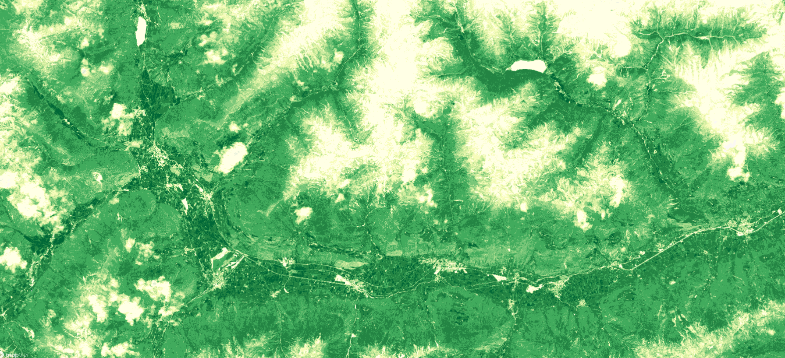

## General description of the script  
This script visualises raw NDVI of the VI product. NDVI quantifies vegetation photosynthetic capacity by measuring the difference between the Near-Infrared (NIR) (which vegetation strongly reflects) and red spectral bands (which vegetation absorbs). Although it is not a physical property of vegetation cover, NDVI is widely used as an indicator for live green vegetation monitoring.  
Physical values range from -1 to 1.he color map is adopted from https://github.com/jacobs-tim/copernicus-land-monitoring-service-hrvpp-colourmaps 

## Description of representative images
*August, 2020 NDVI over South Tyrol Northern Italy* 

  

## Resources

- [Data source](https://land.copernicus.eu/user-corner/technical-library/product-user-manual-of-vegetation-indices/)

- [Entry in public collections](https://github.com/sentinel-hub/public-collections/tree/main/collections/vegetation-indices)
