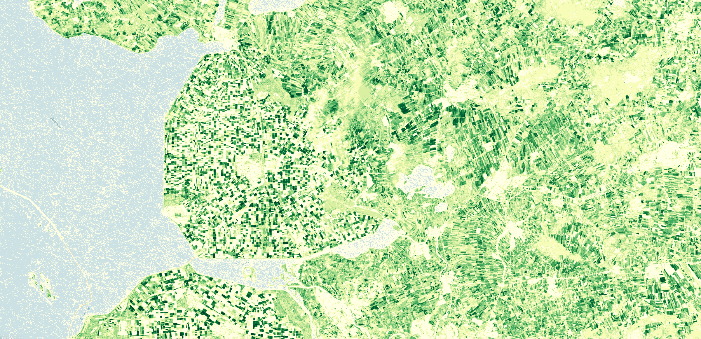

## General description of the script  
This script visualises raw PPI of the VI product. PPI is a physically-based vegetation index derived from radiative transfer equation and is is calculated from red and Near-Infrared (NIR) spectral bands. PPI is  linearly related to green leaf area index, and can be used to track canopy green foliage dynamics and therefore provides an efficient approach to retrieving plant phenology.  
Physical values range from 0 to 3.The color map is adopted from https://github.com/jacobs-tim/copernicus-land-monitoring-service-hrvpp-colourmaps 

  
## Description of representative images
*August, 2020 PPI over Emmeloord, Flevoland Netherlands* 

  

## Resources

- [Data source](https://land.copernicus.eu/user-corner/technical-library/product-user-manual-of-vegetation-indices/)

- [Entry in public collections](https://github.com/sentinel-hub/public-collections/tree/main/collections/vegetation-indices)
