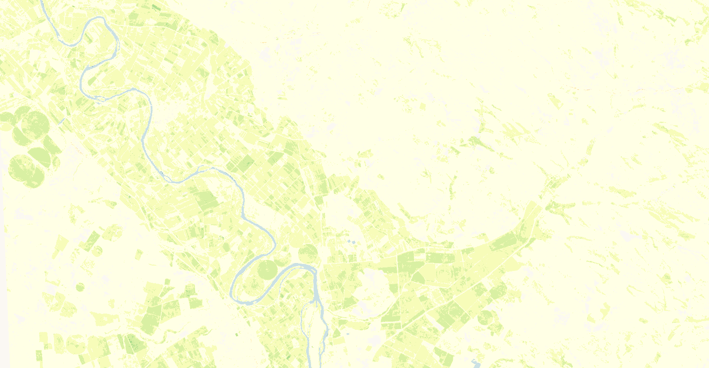

# VPP SOSV visualisation script


<button class="btn btn-primary" id="toggle-script" onclick="toggleScript()">Show Script</button>
[Download Script](script.js){: .btn target="_blank" download="{{paths | append: ".js"}}"}
{: .mt-lg-4 }

 




## General description of the script  
This script visualises start of season value (SOSV) parameter of the VPP product. The color map is adopted from https://github.com/jacobs-tim/copernicus-land-monitoring-service-hrvpp-colourmaps 

  
## Description of representative images
*2019 season 1 start of season value over Pina de Ebro Zaragoza Spain* 

## Resources

- [Data source](https://land.copernicus.eu/pan-european/biophysical-parameters/high-resolution-vegetation-phenology-and-productivity)

- [Entry in public collections](https://github.com/sentinel-hub/public-collections/tree/main/collections/vegetation-phenology-and-productivity-parameters-season-1)

