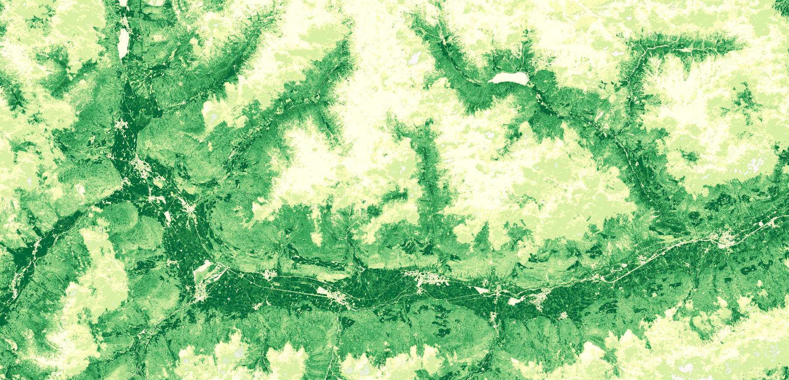

# VI FAPAR visualisation script

<a href="#" id='togglescript'>Show</a> script or [download](script.js){:target="_blank"} it.


      


## General description of the script  
This script visualises raw FAPAR of the VI product. FAPAR corresponds to the fraction of photosynthetically active radiation absorbed by the canopy. FAPAR describes only the green parts of the canopy. FAPAR is very useful in assessing the primary productivity of canopies.  
Physical values range from 0 to 1. The color map is adopted from https://github.com/jacobs-tim/copernicus-land-monitoring-service-hrvpp-colourmaps 

  
## Description of representative images
*August, 2020 FAPAR over South Tyrol Northern Italy* 

  

## Resources

- [Data source](https://land.copernicus.eu/user-corner/technical-library/product-user-manual-of-vegetation-indices/)

- [Entry in public collections](https://github.com/sentinel-hub/public-collections/tree/main/collections/vegetation-indices)
