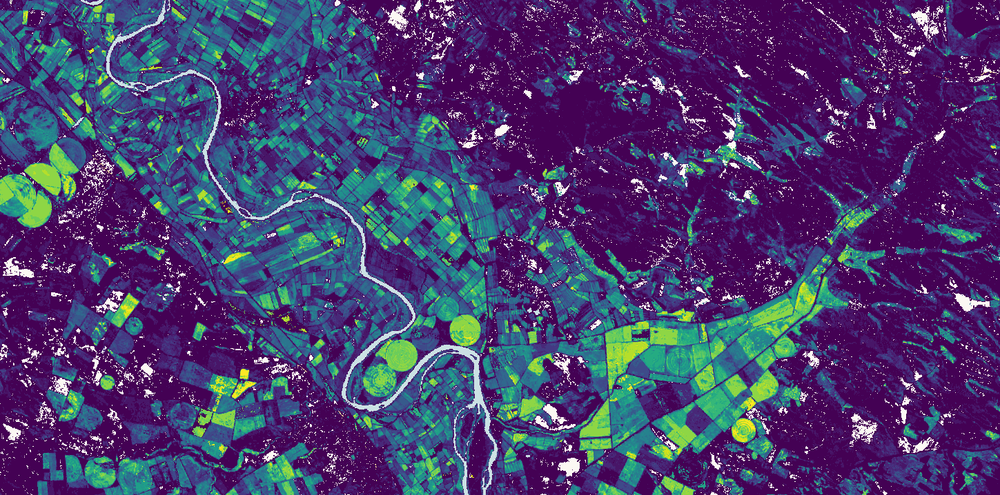

# VPP LSLOPE visualisation script

<a href="#" id='togglescript'>Show</a> script or [download](script.js){:target="_blank"} it.


      


## General description of the script  
This script visualises slope of greening up period  (LSLOPE) parameter of the VPP product. The color map is adopted from https://github.com/jacobs-tim/copernicus-land-monitoring-service-hrvpp-colourmaps 

  
## Description of representative images
*2019 season 1 slope of greening up period over Pina de Ebro Zaragoza Spain* 

## Resources

- [Data source](https://land.copernicus.eu/pan-european/biophysical-parameters/high-resolution-vegetation-phenology-and-productivity)

- [Entry in public collections](https://github.com/sentinel-hub/public-collections/tree/main/collections/vegetation-phenology-and-productivity-parameters-season-1)
