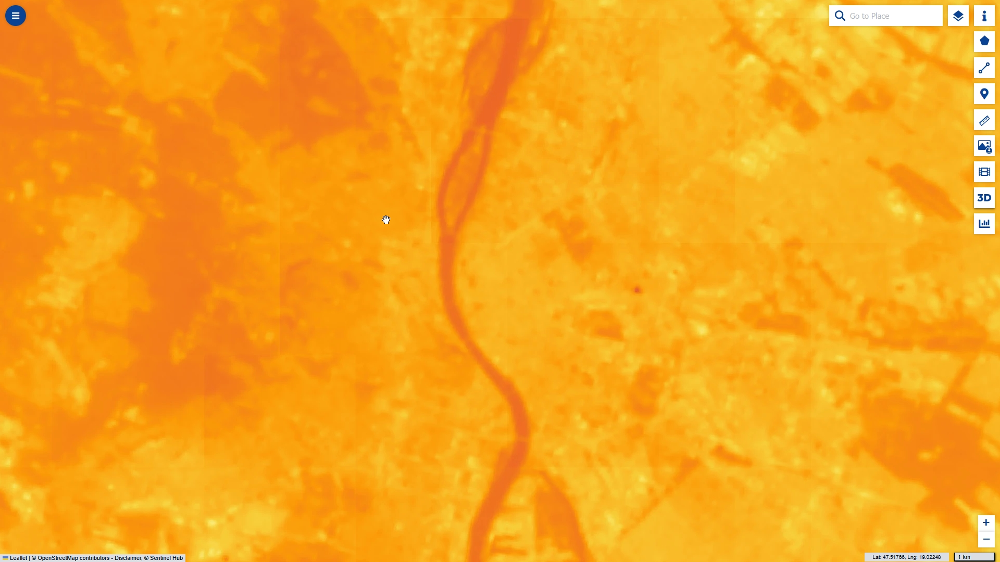
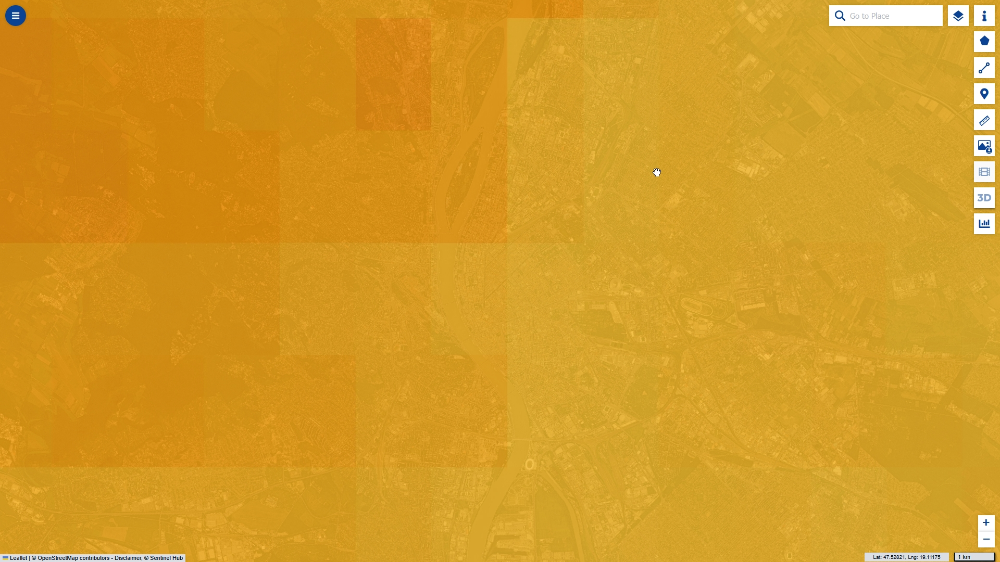
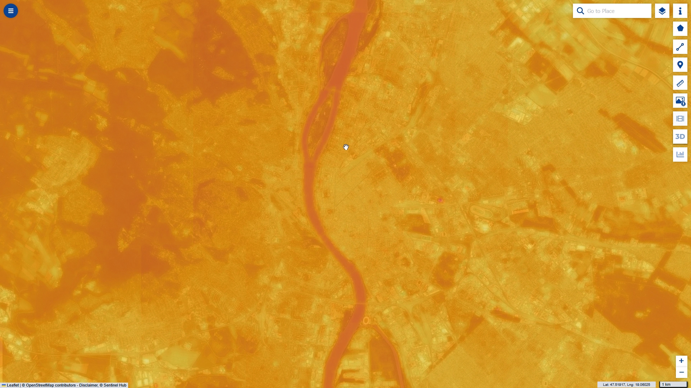
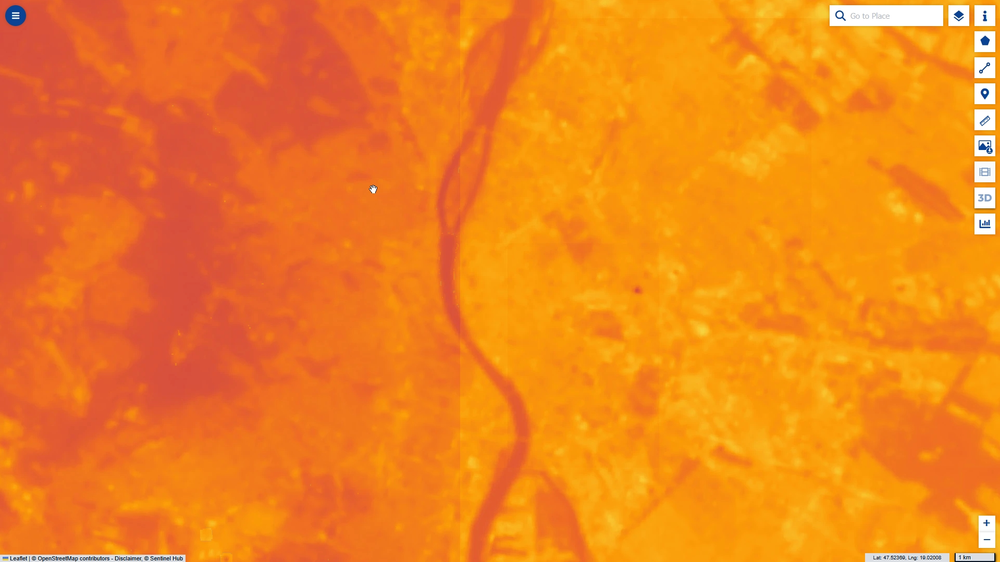

## General description

Copernicus Land Monitoring Service (CLMS) Land Surface Temperature (LST, 3 km hourly V3) collects data every hour and is published with 3-hour latency, but only at a 3 km resolution.
Landsat TIRS resolves LST at 100 m but has an 8–16 day revisit. Alone, neither of these can deliver daily high resolution land surface temperature for urban planning and monitoring of conditions at local scale.

This data fusion script **sharpens** the coarse CLMS LST using the fine spatial detail of a
Landsat thermal image, following a simple additive-residual (statistical downscaling) approach.

First we calculate the difference between Landsat and CLMS temperature at a calibration date where we have both. This can be months or even years old Then we use the difference to sharpen the CLMS temperature dataset for the time of interest. As a result, thermal conditions can be estimated at high resolution and daily frequency, suitable for complementing sensor-based heat monitoring and creating detailed maps to inform urban planning or disaster intervention.

### Method

The underlying assumption is that the *fine-scale spatial structure* of urban LST anomalies
(street canyons, parks, industrial zones) is approximately constant in time within a city. 
Given a cloud-free **calibration date** on which a Landsat overpass and a CLMS acquisition
coincide, the script computes, per pixel and in Kelvin:

```
residual      = LST_landsat_cal − LST_clms_cal          (the fine-scale correction field)
LST_sharpened = LST_clms_target + residual + biasOffset
```

The residual captures the sub-3-km detail that CLMS cannot see. Adding it back to the CLMS LST
for any **target date** produces a CLMS-scale temperature field that carries Landsat-scale
spatial detail.

### Inputs (three datasources)

| Alias | Collection | Timespan | Bands |
|-------|-----------|----------|-------|
| `LANDSAT-OT-L1`  | Landsat 8-9 L1 | calibration date (clear-sky overpass) | `B03, B04, B05, B10, B11` |
| `CLMS_CAL` | CLMS LST 3km hourly V3 | the hour matching the Landsat overpass | `LST, dataMask` |
| `CLMS_TGT` | CLMS LST 3km hourly V3 | target date/hour to sharpen | `LST, dataMask` |

The CLMS collection is deliberately added **twice**, with two different customized timespans —
once for calibration (`CLMS_CAL`) and once for the target (`CLMS_TGT`). CLMS LST is a BYOC
collection documented [here](https://documentation.dataspace.copernicus.eu/APIs/SentinelHub/Data/clms/bio-geophysical-parameters/temperature-and-reflectance/land-surface-temperature/lst_global_3km_hourly_v3.html): Collection ID `12225aec-26dd-4e2c-bbfd-994c253c1ba8`, Location CDSE.

### Landsat LST retrieval

The Landsat land surface temperature is derived using the mono-window / emissivity method from
the [Landsat-8 Land Surface Temperature Mapping script](https://custom-scripts.sentinel-hub.com/landsat-8/land_surface_temperature_mapping/)
by Mohor Gartner: brightness temperature from TIRS band B10 (or B11), NDVI from B04/B05, a
proportional-vegetation emissivity model, and the single-channel LST equation.

The method itself comes from Sobrino & Raissouni (2000) and Sobrino et al. (2008): pixels are
classified by NDVI into water, bare soil, full vegetation and mixed, with the mixed class
interpolated by proportional vegetation cover `Pv` (Carlson & Ripley, 1997) plus a surface
roughness term `C`. The emissivity values themselves (water 0.991, soil 0.966, vegetation 0.973)
originate from Wang et al. (2015), Table 8, computed from the ASTER Spectral Library
(Baldridge et al., 2009). The NDVI thresholds are `NDVIs = 0.2` (Sobrino & Raissouni, 2000) and
`NDVIv = 0.8` (Jiménez-Muñoz et al., 2009, who report 0.801 ± 0.012). The LST equation follows
Artis & Carnahan (1982).

**A note on the roughness constant `C`.** These scripts use `C = 0.005`, the value given by
Sobrino et al. (2008) and used by Avdan & Jovanovska (2016). The Landsat-8 LST Mapping script
from uses `C = 0.009`, a value that appears in Salih et al. (2018); we
were unable to trace it to a primary measurement, so we kept the more widely cited figure. The
practical difference is small — of order 0.2–0.3 K, and only on mixed soil/vegetation pixels —
but it is a real difference, so `C` is exposed in the user options block of all three scripts. Set it
to `0.009` if you need results directly comparable with the original Landsat-8 script.

### CLMS LST decoding

Raw CLMS LST is decoded to Kelvin as `LST_K = rawLST × 0.01 + 273.15`, matching the CLMS LST 3km
hourly V3 default script.

### `biasOffset` — treating CLMS as truth

If you treat the coarse CLMS product as the stronger (but less detailed) truth, the *scene-mean*
of the sharpened result should match CLMS rather than Landsat. A single evalscript cannot compute
a per-CLMS-cell mean (`evaluatePixel` is strictly per-pixel, with no spatial aggregation), so the
script exposes a single scene-wide constant `biasOffset` as the best scalar approximation.

There are two ways to obtain it, both external to `script.js`.

**Measure the residual directly (recommended).** Run `bias_offset.js` (see below) on your calibration
date. It outputs `LST_landsat_cal − LST_clms_cal` per pixel, so `biasOffset = −mean(residual)`.
Because both terms come out of a single request, the same pixels are masked on both sides and the two
retrievals are matched in time by construction.

<!-- TEMPORARY-WORKAROUND: remove when CDSE fixes statistics on data fusion layers -->
> ⚠️ **Temporary — until the Browser histogram is fixed.** The statistics panel does not currently
> work on data fusion layers (see "Outputs" below), so the mean of `bias_offset.js` cannot be read
> from a histogram in the Browser. Until CDSE resolves this, either estimate it from the map by
> tuning `residualCenterK` — the procedure is under "Measuring `biasOffset`" below — or compute it
> with the Statistical API.

**Subtract two layer means.** Run `landsat_lst_reference.js` and the `CLMS_CAL` layer over your area
of interest, read each layer's mean (Copernicus Browser statistics/histogram panel, or the
Statistical API), and set `biasOffset = mean(CLMS_cal) − mean(Landsat_cal)`. Both are single-dataset
layers, so the statistics panel works on them today. The weakness is that the two layers do not mask
the same pixels — Landsat drops cloud-affected and out-of-range pixels that CLMS keeps — so you are
differencing means taken over different pixel sets.

Leave `biasOffset` at `0` to keep pure additive Landsat detail.

Expect this offset to be sizeable. Landsat L1 band B10 is top-of-atmosphere brightness temperature
with no atmospheric correction, so it reads systematically colder than the atmospherically corrected
CLMS LST — over Budapest the difference is around 7.6 K. What matters for the method is not that the
bias is small but that it is *stable*, which is exactly what a single scalar can absorb.

### Validity and masking

A pixel is masked (transparent, `NaN` index) when any of the following holds: the Landsat pixel
fails the raw-band guard (`B10` outside `173–65000`, or `B03/B04/B05 ≤ 0`); the Landsat-derived
LST falls outside a configurable physical range (default −20 °C … +60 °C, catching undetected
cloud / emissivity blow-ups); or either CLMS input has `dataMask === 0`.

### Outputs

Three named outputs: `default` (RGBA color map on the CLMS magma-style ramp), `index` (FLOAT32
sharpened LST in Kelvin), and `dataMask`.

The color ramp range is exposed as `paletteMinK` / `paletteMaxK`. The defaults, 240–330 K
(−33 … +57 °C), reproduce the CLMS LST 3km hourly V3 palette exactly, which is what makes the
sharpened layer directly comparable with the native CLMS layer in the Browser. But that range is
built to cover the whole globe across a whole year, so a single city on a single morning occupies
only a narrow slice of it and most of the ramp goes unused. Narrowing the range — 295–325 K
(+22 … +52 °C) suits a European summer morning — spreads the same ten colors over the temperatures
actually present and makes intra-urban contrast much easier to read. Both values are in Kelvin
(°C = K − 273.15). As with `biasOffset`, use the same values in both scripts when comparing layers;
different ranges make two layers look different for purely cosmetic reasons.

There is deliberately no `browserStats` output. That output exists to feed the Copernicus Browser
**time series** tool, which works by re-running the request over a sequence of time intervals — but
this script pins `CLMS_CAL` to a fixed calibration date, so a swept time range has no coherent
meaning and the tool returns an error.

**Known Copernicus Browser limitation.** The statistics / histogram panel does not work on any data
fusion layer. It fails with `Dataset with id: <alias> not found` even though the same layer renders
correctly, and this is independent of what the datasource is called — declaring a `browserStats`
output does not help either. This is a Browser issue rather than a script one, and it has been
reported to CDSE support. Single-dataset layers are unaffected, so read means and histograms from
`landsat_lst_reference.js` or from a plain CLMS LST layer, and use the Statistical API when you need
statistics on a fused product.

`landsat_lst_reference.js` does declare `browserStats`: it is a single-dataset script with no
pinned timespans, so both the time series tool and the statistics panel behave as expected.

## The three scripts

| File | Datasets | Purpose |
|------|----------|---------|
| `script.js` | Landsat + CLMS ×2 (data fusion) | the sharpening itself |
| `landsat_lst_reference.js` | Landsat 8-9 L1 only | native Landsat LST, to check the sharpening against |
| `bias_offset.js` | Landsat + CLMS ×1 (data fusion) | the Landsat − CLMS residual, to measure `biasOffset` |

`landsat_lst_reference.js` is deliberately a copy of the Landsat half of `script.js` — same band,
same emissivity model, same constants, same guards, same color ramp. Because the retrieval is
identical, any difference between the two layers is attributable to the sharpening rather than to a
difference in method. It differs in two respects, both intentional: it applies a Collection 2 QA
cloud mask (`decodeL8C2Qa`, on by default), since you will be opening arbitrary overpass dates with
it rather than a hand-picked clear-sky scene; and it declares a `browserStats` output, so the
Browser time series tool works on it (see "Outputs" above).

`bias_offset.js` outputs the residual field itself — `LST_landsat_cal − LST_clms_cal` in Kelvin
degrees — rather than a sharpened temperature. It uses the same Landsat retrieval and the same
calibration-date pairing as `script.js`, so the value you measure with it is the value `script.js`
needs. Two deliberate differences: it applies the Collection 2 QA cloud mask, because cloud tops read
cold and would bias the mean in the same direction as the atmospheric effect being measured, making
the two indistinguishable; and it can optionally drop water pixels (`excludeWater`), whose thermal
inertia decouples them from the land signal so that a river or lake shifts the scene mean. It renders
on a diverging blue–neutral–red ramp rather than the CLMS magma ramp, because the residual is a
*signed* quantity whose whole interpretive content is the sign, and a sequential ramp gives the
reader no perceptual anchor at zero.

## How to use in Copernicus Browser

### Sharpening (`script.js`)

The CLMS LST product is not in the standard Copernicus Browser dataset list — it is added as a BYOC
collection, so you will need its Collection ID:

| | |
|---|---|
| Collection ID | `12225aec-26dd-4e2c-bbfd-994c253c1ba8` |
| Type | BYOC |
| Location | CDSE |

(from the [CDSE collection documentation](https://documentation.dataspace.copernicus.eu/APIs/SentinelHub/Data/clms/bio-geophysical-parameters/temperature-and-reflectance/land-surface-temperature/lst_global_3km_hourly_v3.html),
which also documents the bands and the `LST × 0.01 + 273.15` decoding)

1. Find a clear, cloud-free **Landsat 8-9 L1** image over your target area, preferably in the same season as your target date. Use the `Search` panel of the Browser to find the data product and extract the exact sensing time. Note this - you will be using it later. Click `visualize`.

2. On the left panel, click **Custom → Custom script**, and tick
   **"use additional datasets (advanced)"**. This makes Landsat the primary dataset.

3. **Primary dataset — Landsat 8-9 L1.** This is the calibration scene that supplies the spatial
   detail.
   - Datasource alias: `LANDSAT-OT-L1` (the default alias Copernicus Browser offers)
   - Customize timespan: the **calibration date** — a clear-sky Landsat overpass

4. **Additional dataset 1 — CLMS LST 3km hourly V3** (BYOC, Collection ID above, Location CDSE).
   This is the calibration CLMS field, subtracted from Landsat to form the residual.
   - Datasource alias: `CLMS_CAL`
   - Customize timespan: **the same day as the Landsat overpass, and the hourly slot containing
     it** — e.g. 09:00–09:59 UTC for a 09:32 overpass. This must match; see "Matching the hour".

5. **Additional dataset 2 — CLMS LST 3km hourly V3** (same Collection ID, added a second time).
   This is the field you actually want to sharpen.
   - Datasource alias: `CLMS_TGT`
   - Customize timespan: the **target date/hour**, normally the same hour of day as the calibration

6. Paste `script.js` into the script editor and run.

7. Optionally adjust the user options at the top of the script — `paletteMinK` / `paletteMaxK` to
   suit the temperature range of your scene, and `biasOffset` once you have measured it.

The aliases are **case-sensitive** and must match the `setup()` datasources exactly, or the request
will not bind. Note that the CLMS collection is deliberately added **twice**, with two different
timespans — this is what lets a single request see both the calibration and the target field.

**Self-consistency check:** set `CLMS_TGT` to the same date as `CLMS_CAL`. The sharpened output
must then equal the pure Landsat LST (the residual and `CLMS_cal` cancel), which verifies the math.

### Matching the hour

Two separate timing choices matter here, and they are not equally strict.

**`CLMS_CAL` must match the Landsat overpass hour** — same day, same hourly slot. This one is not
optional. The residual is the difference between two supposedly simultaneous observations of the same
surface; any time gap injects real thermal change into it.  Check the acquisition time of your own scene rather than assuming — the Browser shows it in the scene metadata.

**`CLMS_TGT` should normally be the same hour of day, but this is a soft constraint.** The reason is
that the residual field is a *morning* pattern: it encodes how each surface deviates from its 3 km
neighbourhood at mid-morning, under that day's sun angle. Applying it to an afternoon or night-time
CLMS field assumes intra-urban thermal contrast keeps the same spatial shape through the diurnal
cycle, which is a stronger assumption than the temporal stability the method already rests on.
Surfaces with different thermal inertia — water, asphalt, tree canopy — diverge over the day, and
after sunset the pattern can partially invert as dense built-up areas release stored heat while parks
and water cool faster. Keeping both CLMS layers at the overpass hour avoids the question entirely.

That said, sharpening a different hour is the more *useful* application — an afternoon heat peak is
what a planner actually cares about, and CLMS is hourly precisely so you can look at it. So treat the
same-hour rule as the default, and a different hour as a deliberate experiment worth validating
before trusting: run the sharpening for the target hour and compare against whatever independent
thermal observation you can get for that hour. How far the assumption stretches across the diurnal
cycle is an open question this script is well suited to test, not a settled result.

### Measuring `biasOffset` (`bias_offset.js`)

Set up exactly as for the sharpening, but with only **one** additional dataset:

- Primary dataset: **Landsat 8-9 L1** → alias `LANDSAT-OT-L1`
- Additional dataset 1: **CLMS LST 3km hourly V3** (Collection ID above) → alias `CLMS_CAL`

Put both timespans on the calibration date, with `CLMS_CAL` on the hourly slot containing the Landsat
overpass. There is no `CLMS_TGT`: this script measures the calibration pair, it does not sharpen
anything. Keep `band`, `C`, `minValidC` and `maxValidC` identical to `script.js` — the offset is only
valid for the retrieval that produced it. If your area contains open water, set `excludeWater = true`
before reading the mean.

The layer renders on a diverging ramp: blue where Landsat reads colder than CLMS, neutral where the
residual equals `residualCenterK`, red where Landsat reads warmer. With the default
`residualCenterK = 0` a typical scene comes out uniformly blue — that is the top-of-atmosphere cold
bias, and it is the thing you are about to quantify.

<!-- TEMPORARY-WORKAROUND: remove when CDSE fixes statistics on data fusion layers -->
> ⚠️ **Temporary procedure — replace with the histogram once the Browser bug is fixed.**
>
> The intended way to use this script is to open the statistics panel and read the mean and standard
> deviation of the residual directly. That panel does not currently work on fusion layers, so until
> CDSE fixes it, read the mean off the map by bisection:
>
> 1. Start at `residualCenterK = 0`, `residualSpreadK = 15`. Note whether the scene skews blue or red.
> 2. Move `residualCenterK` toward the skew — for a uniformly blue scene, try `-8`.
> 3. Re-run. If the land now reads mostly neutral you are close; if it has flipped to red, you overshot.
> 4. Narrow `residualSpreadK` (to 5, then 2) and repeat until the bulk of the land renders neutral.
>
> `residualCenterK` is then the scene-mean residual, and `biasOffset = −residualCenterK`. At
> `residualSpreadK = 2` the mean is readable to a few tenths of a Kelvin degree, comfortably below
> the accuracy the method needs.
>
> This gives you the mean but **not** the standard deviation — the number that says whether a single
> scene-wide constant describes the residual fairly at all. For that, use the Statistical API.

### Validating against native Landsat (`landsat_lst_reference.js`)

The sharpening is only useful if it reproduces real thermal structure on a date it was *not*
calibrated on. To check that yourself:

1. Pick a **second** Landsat overpass, different from the calibration date, that is also clear-sky.
2. Run `script.js` with `CLMS_TGT` set to the hour of that second overpass, keeping `CLMS_CAL` and
   `LANDSAT-OT-L1` on the original calibration date. This is a genuine prediction — no information
   from the second overpass enters the calculation.
3. In a second layer, run `landsat_lst_reference.js` on that second overpass date. This is the truth
   to compare against.
4. Compare the two visually. The Browser statistics panel can give you a mean and histogram for
   `landsat_lst_reference.js`, but not for the sharpened layer — it does not work on fusion layers
   (see "Outputs" above).

**Keep `biasOffset` consistent between the two scripts.** With `biasOffset = 0` in both, the layers
share the Landsat top-of-atmosphere scale and the difference you see is purely spatial sharpening —
this is the right setting for judging whether the fine structure is reproduced. With the same
non-zero offset in both, they share the CLMS absolute scale, which is the right setting for judging
absolute temperatures. Mixing the two produces a scene-wide difference that says nothing about the
method. The same applies to `paletteMinK` / `paletteMaxK` and to `C`: any comparison between the two
layers is only meaningful if all of these match.

Expect the sharpened layer to look **smoother** than native Landsat even when the method works well:
the residual field is frozen on the calibration date, so thermal structure that genuinely changed
between the two dates cannot be reproduced. That limitation is the assumption being tested.

## Description of representative images

Sharpened land surface temperature over Budapest, Hungary. The calibration date is a clear-sky
Landsat overpass on 13 June 2025 (09:32:47 UTC, matched to the 09:00 CLMS slot); the target CLMS
acquisition is 10 August 2026, 09:00 UTC — the same hour of day, during an ongoing heatwave in
Budapest, and processed the same day thanks to the ~3 hour CLMS latency. The output shows
CLMS-scale temperatures carrying Landsat-scale spatial detail — streets, parks, the Danube, and
built-up districts become distinguishable at a resolution the native 3 km CLMS product cannot
provide.

**Sharpened CLMS LST over Budapest**


The Danube stands out as a cool ribbon, the Buda hills on the west bank read cooler than the dense
Pest districts on the east, and individual parks, rail yards and industrial roofs are resolved. None
of this structure exists in the native 3 km CLMS field, where the whole city spans only a handful of
pixels.

**Native CLMS LST (left) and sharpened CLMS LST (right), both over a VHR true color mosaic**

| Native CLMS LST (3 km) | Landsat-sharpened CLMS LST |
|:----------------------:|:--------------------------:|
|  |  |

Displayed semi-transparently over a 2024 VHR true color mosaic, the thermal pattern can be read
against the urban fabric that produces it: warm anomalies line up with large impervious surfaces and
industrial areas, cool ones with the river, the wooded hills, and the larger parks.

The left-hand panel is the input the sharpening starts from — same view, same hour, same color ramp.
At 3 km the entire metropolitan area is covered by a handful of pixels: the Danube is invisible, the
Buda hills and the Pest districts fall inside the same cells, and the only discernible signal is a
broad west-to-east gradient with hard block boundaries. This is the resolution gap the method
closes — and it is also why the sharpened product remains useful despite its assumptions, since the
alternative is not a better thermal map but essentially no intra-urban information at all.

The two panels also sit at visibly different points on the color ramp, because these examples use
`biasOffset = 0`: the sharpened field inherits the Landsat top-of-atmosphere temperature scale and so
reads cooler than native CLMS. Setting `biasOffset` as described above brings them onto a common
absolute scale.

**Native Landsat LST (left) versus Landsat-sharpened CLMS LST (right)**


This is the validation test described above, with both layers on the same color ramp. The faint
vertical line left of the Danube is the split between the two layers, not a feature of either — and
how hard it is to find is the point of the figure. Thermal features run across the boundary without
a visible step: the Danube, the cool wooded blocks in the west, the warm industrial strips in the
east. The sharpened half is marginally smoother, as expected, since its fine structure comes from the
frozen calibration-date residual and cannot reproduce detail that changed between the two dates.

Example location and dates (Copernicus Browser):

- Location: Budapest, Hungary — `zoom=13`, `lat=47.49523`, `lng=19.05913`
- `LANDSAT-OT-L1` timespan: 13 June 2025 (overpass at 09:32:47 UTC)
- `CLMS_CAL` timespan: 13 June 2025, 09:00–09:59 UTC — the hourly slot containing the overpass
- `CLMS_TGT` timespan: 10 August 2026, 09:00–09:59 UTC

## Caveats

- Structures influencing microclimate are relatively constant in cities but can be less constant in more natural landscapes as vegetation condition or soil water content changes. Use with extra caution outside cities, keep the calibration scene as close as possible in time to the target scene.
- Clouds will influece all three datasets involved. Data gaps will appear where there were missing pixels due to clouds in the CLMS scenes, and erroneous values may appear where clouds affect the Landsat image used for calibration.
- The residual also absorbs the systematic bias between the two different LST retrieval algorithms
  (Landsat vs CLMS), not purely spatial structure.
- The additive-in-Kelvin model treats anomaly magnitude as background-independent. This means that the differences we introduce from the residuals do not scale with the actual temperature, they stay constant. It is a good idea to select a calibration scene from the same season and from the same generic conditions if possible.
- `script.js` does no cloud detection: you must pick a clear-sky Landsat calibration scene yourself.
  Its guards only screen fill / error / gross-outlier pixels, not thin cloud.
  (`landsat_lst_reference.js` does apply a Collection 2 QA cloud mask, since it is meant to be run on
  arbitrary dates.)
- Sharpening cannot recover thermal structure that changed after the calibration date — new
  construction, a harvested field, a recently irrigated park. Re-calibrate periodically.
- The residual is a snapshot of one hour of the diurnal cycle. Calibration requires `CLMS_CAL` at the
  Landsat overpass hour; applying the result to a very different hour of day is an untested
  extrapolation (see "Matching the hour" above).

## Author of the script

- Andras Zlinszky

## References

Scripts and data:

- Mohor Gartner, 2019, [Land Surface Temperature (LST) Mapping Script](https://custom-scripts.sentinel-hub.com/landsat-8/land_surface_temperature_mapping/)
- Copernicus Land Monitoring Service, [Land Surface Temperature 3km hourly V3](https://land.copernicus.eu/en/products/temperature-and-reflectance)
- CDSE, [LST global 3km hourly V3 collection documentation](https://documentation.dataspace.copernicus.eu/APIs/SentinelHub/Data/clms/bio-geophysical-parameters/temperature-and-reflectance/land-surface-temperature/lst_global_3km_hourly_v3.html)
  — BYOC Collection ID, bands and decoding
- Sentinel Hub, [About Landsat 8-9 OLI-TIRS Collection 2 Level 1 Data](https://docs.sentinel-hub.com/api/latest/data/landsat-8/)
- Sentinel Hub, [Data Fusion](https://docs.sentinel-hub.com/api/latest/data/data-fusion/)

Landsat LST retrieval:

- Artis, D. A., & Carnahan, W. H. (1982). Survey of emissivity variability in thermography of urban
  areas. *Remote Sensing of Environment*, 12(4), 313–329. [doi:10.1016/0034-4257(82)90043-8](https://doi.org/10.1016/0034-4257(82)90043-8)
- Avdan, U., & Jovanovska, G. (2016). Algorithm for automated mapping of land surface temperature
  using LANDSAT 8 satellite data. *Journal of Sensors*, 2016, 1480307. [doi:10.1155/2016/1480307](https://doi.org/10.1155/2016/1480307)
- Baldridge, A. M., Hook, S. J., Grove, C. I., & Rivera, G. (2009). The ASTER spectral library
  version 2.0. *Remote Sensing of Environment*, 113(4), 711–715. [doi:10.1016/j.rse.2008.11.007](https://doi.org/10.1016/j.rse.2008.11.007)
- Carlson, T. N., & Ripley, D. A. (1997). On the relation between NDVI, fractional vegetation cover,
  and leaf area index. *Remote Sensing of Environment*, 62(3), 241–252. [doi:10.1016/S0034-4257(97)00104-1](https://doi.org/10.1016/S0034-4257(97)00104-1)
- Jiménez-Muñoz, J. C., Sobrino, J. A., Plaza, A., Guanter, L., Moreno, J., & Martínez, P. (2009).
  Comparison between fractional vegetation cover retrievals from vegetation indices and spectral
  mixture analysis. *Sensors*, 9(2), 768–793. [doi:10.3390/s90200768](https://doi.org/10.3390/s90200768)
- Salih, M. M., Jasim, O. Z., Hassoon, K. I., & Abdalkadhum, A. J. (2018). Land surface temperature
  retrieval from LANDSAT-8 thermal infrared sensor data. *International Journal of Engineering &
  Technology*, 7(4.20), 608–612.
- Sobrino, J. A., & Raissouni, N. (2000). Toward remote sensing methods for land cover dynamic
  monitoring: application to Morocco. *International Journal of Remote Sensing*, 21(2), 353–366.
  [doi:10.1080/014311600210876](https://doi.org/10.1080/014311600210876)
- Sobrino, J. A., Jiménez-Muñoz, J. C., Sòria, G., Romaguera, M., Guanter, L., Moreno, J., Plaza, A.,
  & Martínez, P. (2008). Land surface emissivity retrieval from different VNIR and TIR sensors.
  *IEEE Transactions on Geoscience and Remote Sensing*, 46(2), 316–327. [doi:10.1109/TGRS.2007.904834](https://doi.org/10.1109/TGRS.2007.904834)
- Wang, F., Qin, Z., Song, C., Tu, L., Karnieli, A., & Zhao, S. (2015). An improved mono-window
  algorithm for land surface temperature retrieval from Landsat 8 thermal infrared sensor data.
  *Remote Sensing*, 7(4), 4268–4289. [doi:10.3390/rs70404268](https://doi.org/10.3390/rs70404268)
