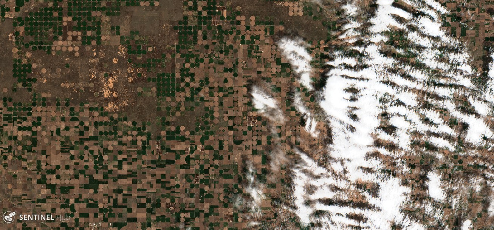
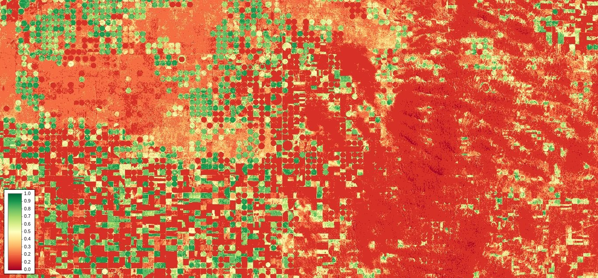
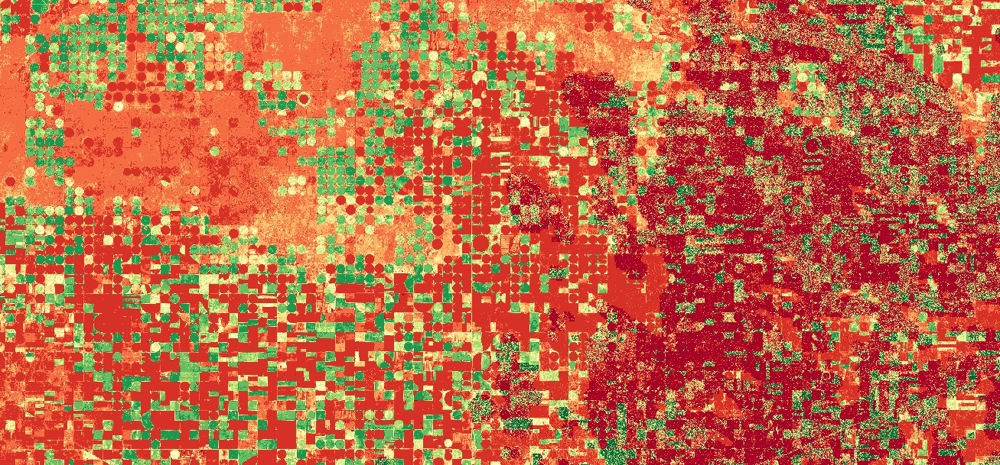

# Mapping Soybean and Maize NDVI with Sentinel-1 and Sentinel-2
  
<a href="#" id='togglescript'>Show</a> script or [download](script.js){:target="_blank"} it.  

  
  
  
  

  
  
## Evaluate and visualize  
 - [EO Browser](https://sentinelshare.page.link/i7t2)
 - [Euro Data Cube](https://eurodatacube.com/marketplace/notebooks/contributions/EDC_SentinelHub_DataFusion_NDVI.ipynb){:target="_blank"}   
  
## General description of the script  
  
[NDVI](https://custom-scripts.sentinel-hub.com/sentinel-2/ndvi/) is a widely used vegetation index that uses Near Infra-Red (NIR) and Red wavelengths to measure the photosynthetic capacity of plant canopies. This index is a widely-used tool to assess agricultural crop conditions throughout the phenological cycle of the crops, linking chlorophyll activity to yield or canopy health [e.g. 1, 2].

[Sentinel-2](https://www.sentinel-hub.com/explore/data/) is an ideal tool to monitor NDVI based on its NIR ([B08](https://docs.sentinel-hub.com/api/latest/#/data/Sentinel-2-L2A?id=available-bands-and-data), 842 nm) and Red bands ([B04](https://docs.sentinel-hub.com/api/latest/#/data/Sentinel-2-L2A?id=available-bands-and-data), 665 nm), owing to its large coverage, high spatial resolution (10/20 m), regular overpasses (~ 5 days) in comparison to other sensors. However, depending on the region and time of year, cloud cover can lead to sparse observations with the consequence of missing key stages of vegetation growth or activity. Furthermore, a 5-day revisit-time may not be sufficient to capture rapid changes in vegetation cover. Therefore, the combined use of multiple data sources is key for monitoring NDVI.

Studies have linked Synthetic Aperture Radar (SAR) backscattering data to vegetation development [e.g. 3, 4], and in particular to NDVI [5]. C-band SAR satellites such as Sentinel-1 offer frequent (~ 6 days) high-resolution observations of the Earth's surface that have the advantage of being unaffected by cloud cover.

In this example, we combine a Sentinel-2 L2A NDVI product partly occulted by clouds with Sentinel-1 GRD observation to produce a seamless NDVI product, based on the relationship between radar backscatter and NDVI [5].

**Note:**

The method developed by Filgueiras et al. (2019) is based on regression algorithms between Sentinel-2 and Sentinel-1 images. For simplicity, the A3 approach with a linear regression is used in this example. However, it should be noted that the approach is less accurate for areas with low biomass (NDVI < 0.25). Although the method enables the monitoring of vegetation independently of optical sensors, calibration for the type of crop is needed. For illustration purposes here, the algorithm was applied to an area consisting mostly of sorghum and wheat. However, the regression parameters obtained from Filgueiras et al. (2019) for soybean and maize
 were not changed, thus leading to a bias in the absolute values of NDVI. 

## Description of representative images  
  
1. Sentinel-2 L2A [True Color Composite](https://apps.sentinel-hub.com/eo-browser/?lat=37.7235&lng=-100.8442&zoom=11&time=2019-04-26&preset=1_TRUE_COLOR&datasource=Sentinel-2%20L2A) (enhanced), West Kansas.  
   
2. Sentinel-2 L2A [NDVI](https://custom-scripts.sentinel-hub.com/sentinel-2/ndvi/), West Kansas. 
  
3. Sentinel-2 L2A / Sentinel-1 GRD NDVI, West Kansas. 
  

## References

[1] _Quarmby et al., 1993, The use of multi-temporal NDVI measurements from AVHRR data for crop yield estimation and prediction, DOI: [10.1080/01431169308904332](https://www.tandfonline.com/doi/abs/10.1080/01431169308904332)._

[2] _Mazzetto et al., 2010, Integration of optical and analogue sensors for monitoring canopy health and vigour in precision viticulture, DOI: [10.1007/s11119-010-9186-1](https://link.springer.com/article/10.1007/s11119-010-9186-1)._

[3] _Capodici et al., 2013, Investigating the Relationship between X-Band SAR Data from COSMO-SkyMed Satellite and NDVI for LAI Detection. DOI: [10.3390/rs5031389](https://www.mdpi.com/2072-4292/5/3/1389)._

[4] _Inoue et al., 2014, Capability of C-band backscattering coefficients from high-resolution satellite SAR sensors to assess biophysical variables in paddy rice, DOI: [10.1016/j.rse.2013.09.001](https://www.sciencedirect.com/science/article/abs/pii/S0034425713003039)._

[5] _Filgueiras et al., 2019, Crop NDVI Monitoring Based on Sentinel 1, DOI: [10.3390/rs11121441](https://www.mdpi.com/2072-4292/11/12/1441)._
  
## Contributors:  
Maxim Lamare
