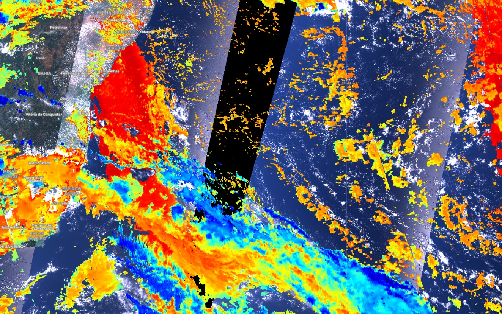

## Authors

**Author of the datafusion script:**
- Monja B. Šebela
  
## Evaluate and visualize  
 - [EO Browser](https://sentinelshare.page.link/rKYk)
  
## General description of the script  
  
As Sentinel-5P is transparent where there is no data, this script fills in the gaps with true color Sentinel-3 OLCI imagery. It can be useful to get a feeling of the land below the clouds, or to show the underestimation of S5P cloud products, where white clouds are visible. 
The script can be modified to fit any Sentinel-5P product, by just replacing the "band" in custom script, and by replacing the visualization (this is very important, as S5P products have different units). 

## Description of representative images  
  
**Cloud base pressure over OLCI true color**
 
