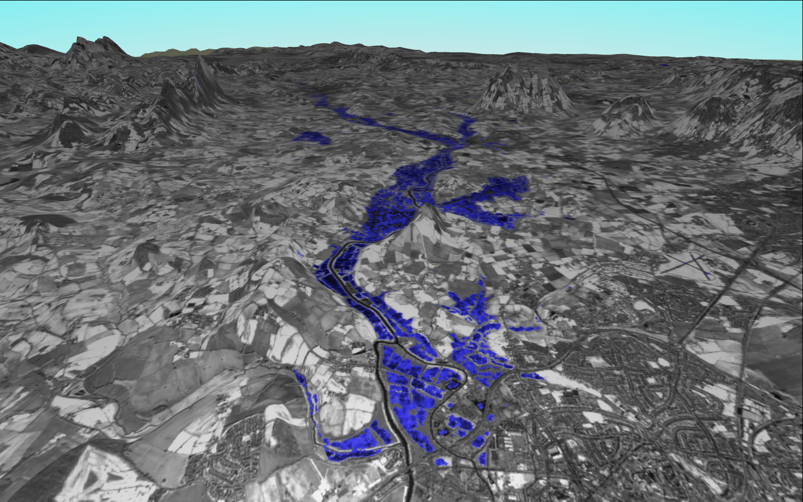
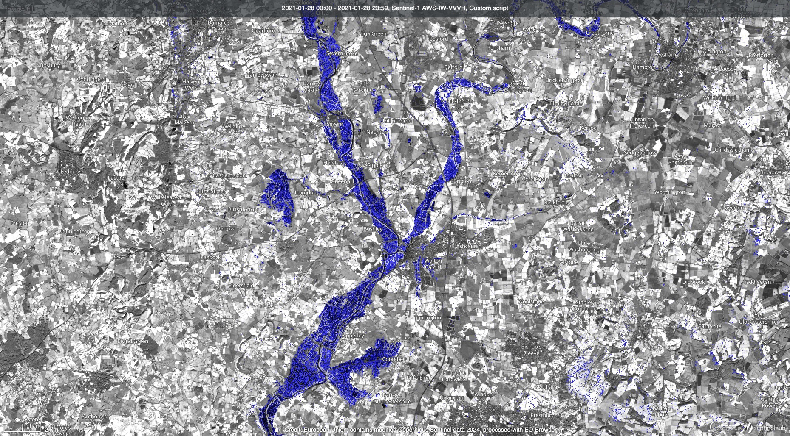

## Authors

**Author of the datafusion script:**
- William Ray & Maxim Lamare
  
## Evaluate and visualize  
 - [EO Browser](https://sentinelshare.page.link/i2yk)
 - [Copernicus Browser](https://link.dataspace.copernicus.eu/2ufw)
  
## General description of the script  
  
This script can be used to visualise flood events using Sentinel-1 GRD imagery. This is especially useful for areas of interest that are affected by cloud cover (common during flood events caused by excessive rainfall). The script uses a threshold of -15 decibels to classify flooded pixels. This value can be adjusted to suit your area of interest using the `lim` parameter. In addition, to help the viewer orientate themselves, a clear Sentinel-2 image is used as the basemap for this visualisation so that it can be easily interpreted where the flood extent reaches for those unfamiliar with interpreting SAR images. 

### How to use

- Select your area of interest
- From Data Collections, select `Sentinel-2 Mosaic` or `Sentinel-2 L2A`. You can choose the most recent mosaic or the one from the same season as your time of interest; if you are selecting a single image, make sure it is cloud free.
- From Layers, select Custom Script. Click the Custom Script tab, and check the `Use additional datasets (advanced)` box. Under `Additional datasets`, you will see `S-1 GRD`. Click the `+` Sign to add it. Make sure you enable orthorectification. Optionally, you can also use a speckle filter.
- Check the `Customize timespan` box and select the timeframe you are interested in (the timeframe of your flood)
- Now paste the script in the code field. Take care to use the right one, `Copernicus Browser` if you are using a single Sentinel-2 image as a background and `Sentinel-2 Mosaic` if you want the mosaic background. Then click `Refresh Evalscript`.
- If you want to adjust the brightness of the background image, change the `f` constant. It is typically around 2.5 for Sentinel-2 images and 0.0008 for Sentinel-2 mosaics, increasing the gain makes the image brighter.

### Interpretation of results

Flooded areas will be marked in blue. Since this is a SAR dataset, the resulting map is affected by SAR speckle. In some cases, wet vegetation fields, steep slopes facing away from the sensor, or large flat surfaces such as airports can also create low backscatter and can thus be mistaken for flooded areas. Therefore, the 3D view can also be helpful for interpreting results: flooded areas are usually in the valley bottoms. 

**Verification of flooding on a 3D image**
 

## Description of representative images  

In late 2023 and early 2024, north-western Europe experienced very high levels of rainfall, which led to widespread river flooding. This scene shows the Severn River upstream of Gloucester on 01 January 2024, with a Sentinel-2 image from 28 February 2024 as a background.

**Flooding in the UK 28th January 2021**
 
