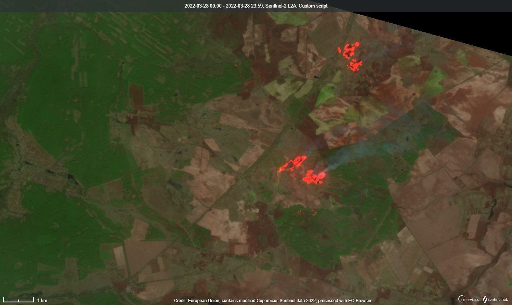
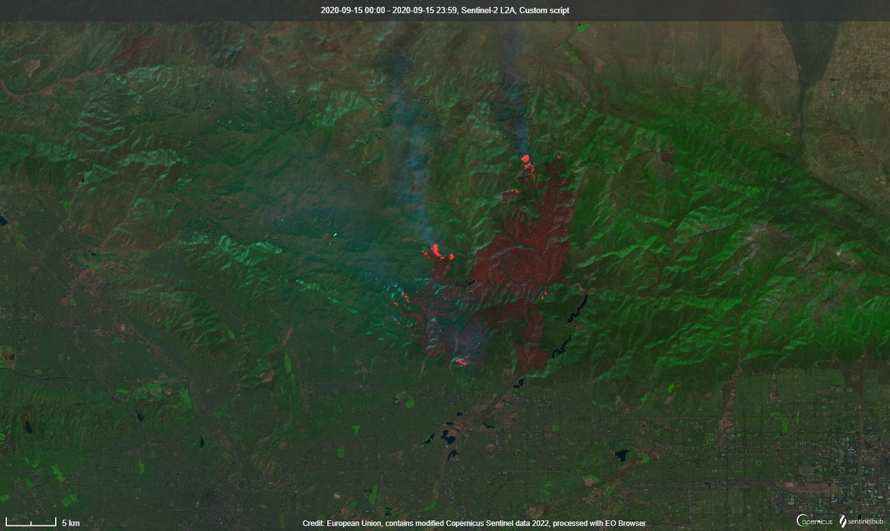

# S2L2A Enhancement using S3SLTR F2 For Wildfire Detection
  
<a href="#" id='togglescript'>Show</a> script or [download](script.js){:target="_blank"} it.  

  
  
  
  

  
  
## Evaluate and visualize  
 - [EO Browser](https://sentinelshare.page.link/QgcU)

## Data collections 

- Sentinel-2 L2A
- Sentinel-3 SLSTR
  
## General description of the script  
  
This script uses a combination of two different satellites -- S2L2A and S3SLTR -- to better highlight areas burning due to wildfires. The way this script works is it adjusts the brightness of the S2L2A, true color image using a scaled value of the S3SLSTR F2 value, which increases the brightness of areas that are burning, and decreases the value of areas which are not burning.

**Limitations**

This script has only been tested against a small number of California wildfires, plus wildfires/warfare zones in Ukraine. It's unproven and untested against a larger sample set.

## Description of representative images  
  
**Irpin, Ukraine (March 2022)**

 

**Bobcat Fire, Los Angeles, CA (September 2020)**

  

## Author of the script: 
- Benjamin Kuo
