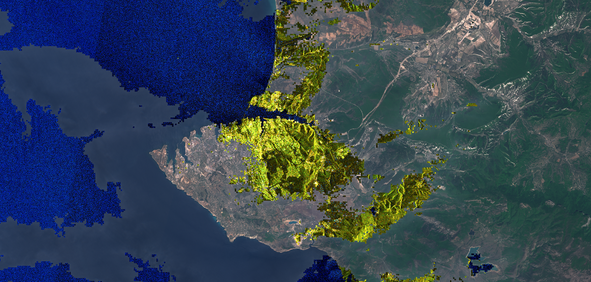

## Evaluate and visualize
 - [EO Browser](https://sentinelshare.page.link/wD4y)

## General description
The script uses cloud masks to identify cloudy sentinel-2 areas and replace the data with terrain visualisation based on Sentinel-1 data. 

## Description of representative images  

Sevastopol with cloudy areas in Sentinel-1, and non-cloudy areas in Sentinel-2. 

## Contributors:
 - Pierre Markuse, (Twitter: @pierre_markuse)

## License

 - [CC BY 4.0 International](https://creativecommons.org/licenses/by/4.0/){:target="_blank"}
