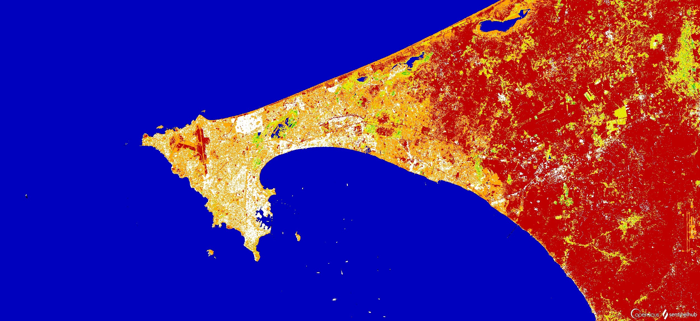
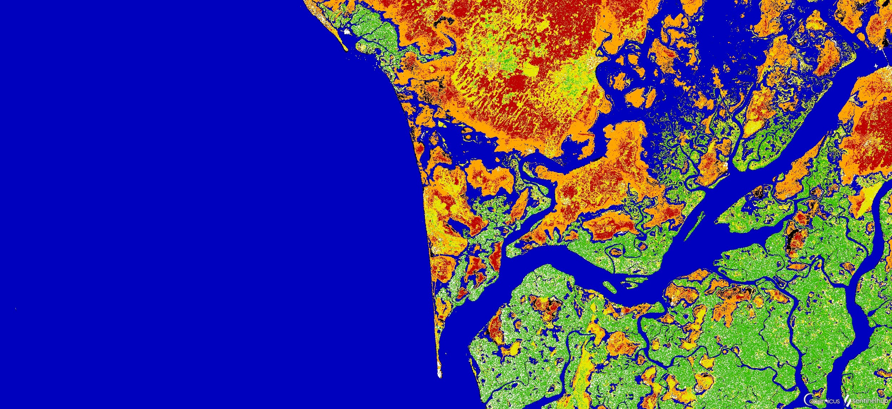
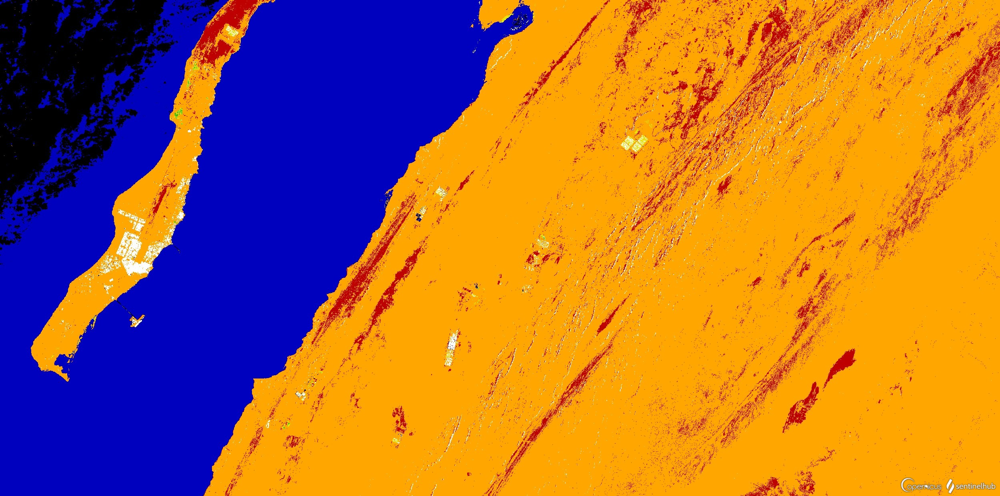
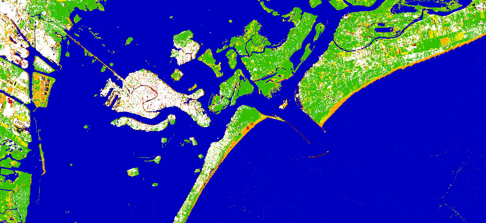

# Data-Fusion Sand-Oriented Land Cover Classification

<a href="#" id='togglescript'>Show</a> script or [download](script.js){:target="_blank"} it.





## Evaluate and visualize  
 - [EO Browser](https://apps.sentinel-hub.com/eo-browser/?zoom=12&lat=14.73536&lng=-17.35926&themeId=DEFAULT-THEME&visualizationUrl=https%3A%2F%2Fservices.sentinel-hub.com%2Fogc%2Fwms%2Fbd86bcc0-f318-402b-a145-015f85b9427e&evalscript=Ly9WRVJTSU9OPTMKLy9BdXRob3I6IFJlZ2lvbmUgZGVsIFZlbmV0bwoKZnVuY3Rpb24gc2V0dXAoKSB7CiAgICByZXR1cm4gewogICAgICAgIGlucHV0OiBbCiAgICAgICAgICAgIHtkYXRhc291cmNlOiAiUzFHUkQiLCBiYW5kczpbIlZWIiwgIlZIIl0sIG9ydGhvcmVjdGlmeToiVFJVRSJ9LAogICAgICAgICAgICB7ZGF0YXNvdXJjZTogIlMyTDJBIiwgYmFuZHM6WyJCMDIiLCAiQjAzIiwgIkIwNCIsICJCMDgiLCJCMTEiLCJCMTIiXX0KICAgICAgICBdLAogICAgICAgIG91dHB1dDogWwogICAgICAgICAgICB7IGlkOiAiZGVmYXVsdCIsIGJhbmRzOiAzfQogICAgICAgIF0KICAgIH07Cn0KCmZ1bmN0aW9uIGV2YWx1YXRlUGl4ZWwoc2FtcGxlcykgewoKICAgIC8vIFNldHRpbmcgdGhlIHNhbXBsZXMgZm9yIFNlbnRpbmVsLTEgYW5kIFNlbnRpbmVsLTIgcHJvZHVjdHMKICAgIGxldCBTMSA9IHNhbXBsZXMuUzFHUkRbMF0KICAgIGxldCBTMiA9IHNhbXBsZXMuUzJMMkFbMF0KICAgIAogICAgLy9Db21wdXRpbmcgdGhlIGluZGljZXMgZm9yIGltYWdlIGNsYXNzaWZpY2F0aW9uCiAgICAvLyBOb3JtYWxpemVkIERpZmZlcmVuY2UgVmVnZXRhdGlvbiBJbmRleAogICAgbGV0IG5kdmkgPSBpbmRleChTMi5CMDgsUzIuQjA0KQogICAgLy8gTW9kaWZpZWQgTm9ybWFsaXplZCBEaWZmZXJlbmNlIFdhdGVyIEluZGV4CiAgICBsZXQgbW5kd2kgPSBpbmRleChTMi5CMDMsUzIuQjEyKQogICAgLy8gQmFyZSBTb2lsIEluZGV4CiAgICBsZXQgYnNpID0gKChTMi5CMTEgKyBTMi5CMDQpIC0gKFMyLkIwOCArIFMyLkIwMikpIC8gKChTMi5CMTEgKyBTMi5CMDQpICsgKFMyLkIwOCArIFMyLkIwMikpCiAgICAvLyAoTkVXKSBNb2RpZmllZCBOb3JtYWxpemVkIERpZmZlcmVuY2UgU2FuZCBJbmRleAogICAgbGV0IG1uZHNpID0gaW5kZXgoUzIuQjA0LFMyLkIwMikKCiAgICAvL1NldHRpbmcgdGhyZXNob2xkIHZhbHVlcyBmb3IgaW1hZ2UgY2xhc3NpZmljYXRpb24KICAgIC8vIEV4dHJhY3RzIGJ1aWx0LXVwIGFyZWFzIGluIHdoaXRlCiAgICBpZiAoUzEuVkggPiAwLjIgfHwgUzEuVlYgPiAwLjIpIHsKICAgICAgICByZXR1cm4gewogICAgICAgICAgICBkZWZhdWx0OiBbMSwxLDFdCiAgICAgICAgfX0KICAgIC8vIEV4dHJhY3RzIHNocnViIGFuZCBncmFzc2xhbmQgaW4gfnllbGxvdwogICAgaWYgKG5kdmkgPiAwLjIgJiYgbmR2aSA8IDAuNCkgewogICAgICAgIHJldHVybiB7CiAgICAgICAgICAgIGRlZmF1bHQ6IFswLjksMC45LDBdCiAgICAgICAgfX0KICAgIC8vIEV4dHJhY3RzIGZsb3VyaXNoaW5nIHZlZ2V0YXRpb24gaW4gfmdyZWVuCiAgICBpZiAobmR2aSA%2BPSAwLjQpIHsKICAgICAgICByZXR1cm4gewogICAgICAgICAgICBkZWZhdWx0OiBbMC4yLDAuNzUsMF0KICAgICAgICB9fQogICAgLy8gRXh0cmFjdHMgd2F0ZXIgYm9kaWVzIGluIH5ibHVlCiAgICBpZiAobW5kd2kgPiAwICYmIFMxLlZIIDwgMC4wMTUpIHsKICAgICAgICByZXR1cm4gewogICAgICAgICAgICBkZWZhdWx0OiBbMCwwLDAuNzVdCiAgICAgICAgfX0KICAgIC8vIEV4dHJhY3RzIGJhcmUgc29pbHMgaW4gfnJlZAogICAgaWYgKGJzaSA%2BIDAuMikgewogICAgICAgIHJldHVybiB7CiAgICAgICAgICAgIGRlZmF1bHQ6IFswLjc1LDAsMF0KICAgICAgICB9fQogICAgLy8gRXh0cmFjdHMgc2FuZCBzdXJmYWNlIGluIH5vcmFuZ2UKICAgIGlmIChtbmRzaSA%2BIDAuMSkgewogICAgICAgIHJldHVybiB7CiAgICAgICAgICAgIGRlZmF1bHQ6IFsxLDAuNjUsMF0KICAgICAgICB9fQogICAgLy8gTGVhdmUgaW4gYmxhY2sgdW5jbGFzc2lmaWVkIHBpeGVscwogICAgZWxzZXsKICAgIHJldHVybiB7CiAgICAgIGRlZmF1bHQ6IFswLDAsMF0KICAgIH19Cn0KCg%3D%3D&datasetId=S2L2A&fromTime=2019-06-16T00%3A00%3A00.000Z&toTime=2021-06-16T23%3A59%3A59.999Z&dataFusion=%5B%7B%22id%22%3A%22AWS_S2L2A%22%2C%22alias%22%3A%22S2L2A%22%7D%2C%7B%22id%22%3A%22AWSEU_S1GRD%22%2C%22alias%22%3A%22S1GRD%22%7D%5D#custom-script){:target="_blank"}

## General description of the script

The main goal of the script is to highlight one of the most relevant surface elements of both Dakar and the African territories in general, which is sand. Indeed, intense phenomena such as desertification and sandstorms constantly affect the African continent, slowing down its social and economic development [1]. Furthermore, vacant soil made of sand constitutes a large portion of the land that could accommodate new urban areas [2]. In the same manner, sand detection can also be helpful for monitoring coastline erosion and for crop management and agricultural applications [3].

As such, we propose a script able to produce a “sand-oriented” land cover classification, which we believe can be a preliminary tool to help tackling the challenges mentioned above, as well as help answering the needs of the 2030 Agenda [4]. Specifically, such preliminary analysis can help feeding indicators associated to different Sustainable Development Goals (SDGs). Firstly, facing desertification (Goal 15 “Life on land”, target 15.3) and therefore contributing to better agricultural productivity in order to face hunger (Goal 2 “Zero hunger”, target 2.4). Moreover, it can provide a useful support for protecting water-related ecosystems (Goal 6 “Clean water and sanitation”, target 6.6) and natural environments from climate change’s impact (Goal 13 “Climate action”, target 13.1). Lastly, sand detection and sand monitoring can be crucial to foster a sustainable urbanization, for example helping the slum dwellers in arid environments (such as those of Dakar), where sandstorms mostly affect those who live in inadequate structures or monitoring the healthiness of urban green spaces (Goal 11 “Sustainable cities and communities”, targets 11.3 and 11.7, respectively).

As mentioned above, the script is based on a land-cover classification that aims at highlighting soils and surfaces associated with sandy terrain. In order to produce this classification, imagery data was collected from both Sentinel-1 (S-1) and Sentinel-2 (S-2). In particular, we exploited the S1GRD and S2L2A products. Firstly, VV and VH polarizations from S-1 are used to extract buildings, displayed in white. NDVI (Normalized Difference Vegetation Index) is then computed to identify two classes of vegetation, such as shrub and flourishing flora [5], which appear in yellow and green, respectively. A combination between MNDWI (Modified Normalized Difference Water Index) [6] from S-2 and VH polarization from S-1 is used to extract water bodies, classified in blue.

Subsequently. BSI (Bare Soil Index) [7] classifies all bare soil and unvegetated land in red colour. Lastly, we propose a new index named Modified Normalized Difference Sand Index (MNDSI), which operates in the visible wavelength on the S-2 sensor (B04 and B02), as opposed to NDSI (proposed by [8]), which takes into account the SWIR and the red bands from Landsat TM. In fact, if analysed together with all previous variables (following the specified order of declaration), we believe MNDSI is able to better identify reddish surfaces, such as sand (displayed in orange), which otherwise can be more likely misclassified as other unvegetated or bare soil, if considering the SWIR wavelength (NDSI). All remaining unclassified pixels are displayed in black.

## Details of the script

This classification provides a promising result: the surface of Dakar covered by sand seems to be thoroughly classified (Figure 1), especially in the coastal areas. The script works well also in the region south of Dakar (Figure 2) and within the Sahara Desert (Figure 3). The script was also tested in other areas with different environments, for example in the Venice lagoon, where the coastline (made of sand) is very well highlighted (Figure 4).

However, the script exhibits some limitations related to the band wavelengths and spectral resolution available from the data sources considered. In particular, working in the visible wavelength, MNDSI does not take into account the infrared spectral composition of sand surfaces (since in this wavelength range, they are not easily distinguishable from other bare soil surfaces with the bands available). Moreover, the optimal threshold values used to distinguish bare soil (BSI) from actual sand (MNDSI) were set through empirical tests and thus may vary depending on the target area. Despite these limitations, the script displays encouraging results in various contexts, especially in those related to arid environments (such as that of Dakar).

The increasing availability of imagery data with greater numbers of bands (in this case in the shortwave and even thermal infrared wavelengths) and with higher spectral resolutions would improve the script accuracy and its applicability to different environments. Furthermore, expanding the script to a multi-temporal analysis might be helpful to monitor the occurrence of extreme events (such as sandstorms) and their spread on the surface, as well as for other change-detection applications.

## Authors of the script

Regione del Veneto team:  
Niccolò Tolio, Andrea Semenzato, Umberto Trivelloni, Silvano De Zorzi, Daniele Piccolo, Mirko Frigerio, Alessandro La Rocca

## Description of representative images

The image displays the script application to the Dakar region. In white are dense urban areas, such as Plateau (in the southern part of the peninsula) classified from Sentinel-1. Vegetated areas, either shrub or flourishing flora (respectively in yellow and green) are concentrated near water bodies (in blue) or sparsely located in small patches. The extraction of bare soils (in red) correctly identifies the main infrastructures, such as large road and streets, airport runways, and other non-vegetated fields in the inland areas. Most of all, the use of MNDSI (computed after all other indices and band operations) allows a good identification of sandy soils and surfaces. For example, the coastlines made of sand are well detected both in the northern and south-eastern areas of the Dakar peninsula.

Saloum Delta, south of Dakar. Comprised mostly of swamps, wetlands and small islands, this natural environment is widely covered by sand surfaces (especially in the northern sector), which are thoroughly detected by the script.

Portion of the Sahara Desert, in Southern Morocco. The large orange area detected by the script relates to the extensive sand dune fields of the desert. Moreover, red pixels correctly represent high crests and hills that are not covered by sand, therefore exposing bare soils and rock surfaces. These portions can change periodically due to the wind.

Detail of the Venice lagoon. The script highlights extensive beaches (made of sand) in the touristic areas of the coastline facing the Adriatic Sea. Some inland fields are also displayed in orange: considering the acquisition date of the image (July), these farmlands likely relate to harvested fields, and therefore such bare soils display similar visible and infrared signature to sand surfaces.

## References

[1] Darkoh, M. B. K. (1998). The nature, causes and consequences of desertification in the drylands of Africa. Land Degradation & Development, 9(1), 1-20.  
[2] Japan International Cooperation Agency 2016, [Project for Urban Master Plan of Dakar and Neighboring Area for 2035](https://openjicareport.jica.go.jp/pdf/12250015_01.pdf)  
[3] Sivakumar, M. V. (2005). Impacts of natural disasters in agriculture, rangeland and forestry: an overview. Natural disasters and extreme events in Agriculture, 1-22.  
[4] European Global Navigation Satellite System and Copernicus: [Supporting the Sustainable Development Goals. Building Blocks towards the 2030 Agenda](https://www.unoosa.org/res/oosadoc/data/documents/2018/stspace/stspace71_0_html/st_space_71E.pdf); United Nations Office at Vienna: Vienna, Austria, 2018.  
[5] Xue, J., & Su, B. (2017). Significant remote sensing vegetation indices: A review of developments and applications. Journal of sensors, 2017.  
[6] Xu, H. (2006). Modification of normalised difference water index (NDWI) to enhance open water features in remotely sensed imagery. International journal of remote sensing, 27(14), 3025-3033.  
[7] Nguyen, C. T., Chidthaisong, A., Kieu Diem, P., & Huo, L. Z. (2021). A Modified Bare Soil Index to Identify Bare Land Features during Agricultural Fallow-Period in Southeast Asia Using Landsat 8. Land, 10(3), 231.  
[8] Fadhil, A. M. (2013, March). Sand dunes monitoring using remote sensing and GIS techniques for some sites in Iraq. In PIAGENG 2013: Intelligent information, control, and communication technology for agricultural engineering (Vol. 8762, p. 876206). International Society for Optics and Photonics.
