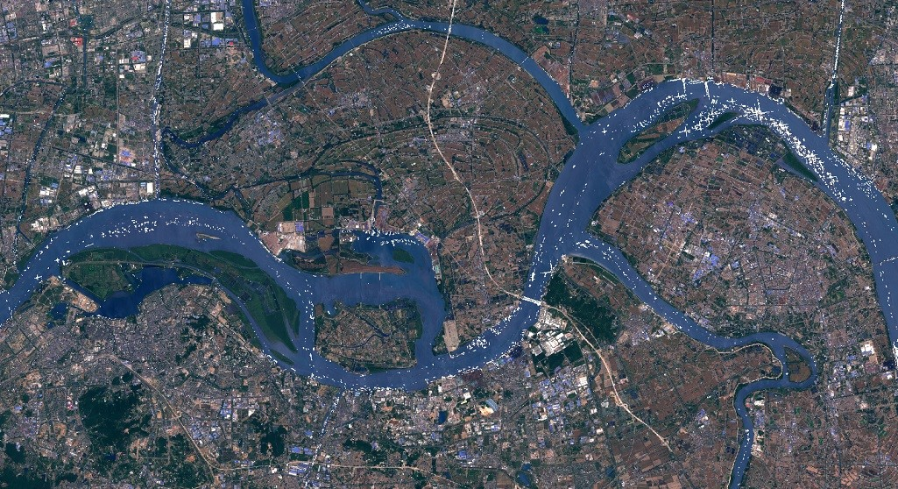

# Ship detection with Sentinel-1 and Sentinel-2
  
<a href="#" id='togglescript'>Show</a> script or [download](script.js){:target="_blank"} it.  

  
  
  
  

  

## Author: 
Monja B. Šebela
  
## Evaluate and visualize  
 - [EO Browser](https://sentinelshare.page.link/gjRX)
  
## General description of the script  
  
This script masks water areas using Sentinel-2 NDWI, and returns the high NDWI pixels, which also highly reflect VV and VH polarizations, in white, displaying ships. The script tends to overestimate in narrow water corridors, over bridges, and it has cross-like artefacts where pixels are extremely reflective. It often underestimates ships of red color. It can be useful to generally estimate ship traffic density. 

## Description of representative images  
  
**Ship traffic of Yangtze river, at Zhenjiang and Yangzhong, China**
 
