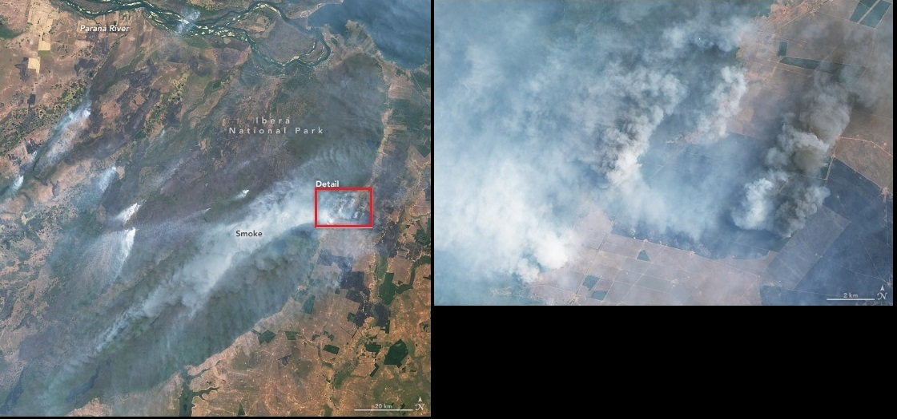
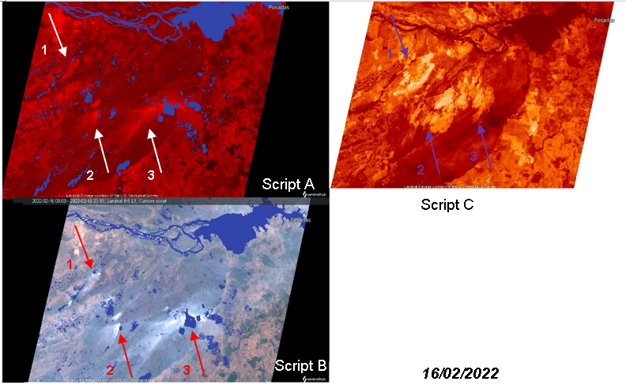
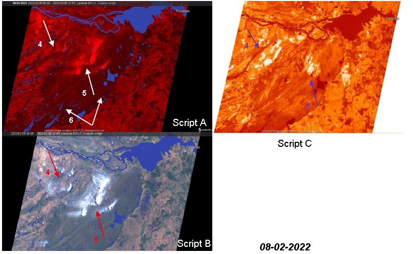
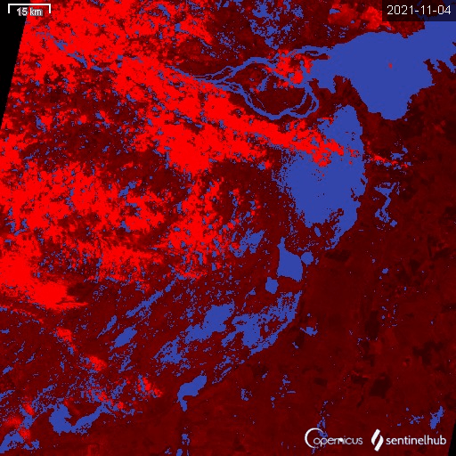

# Thermal Visualization and Water In Wetlands Script 

<a href="#" id='togglescript'>Show</a> script or [download](script.js){:target="_blank"} it.  

  
  
  
  

  

## Evaluate and visualize
 
- [EO Browser](https://sentinelshare.page.link/zeUH)

## General description of the script
 
This script uses data fusion to combine both, the temperature of the surface and the humidity of the wetlands in a single script. Landsat 8-9 OLI-TIRS Collection 2 Level 1 Data was used. The aim is to prevent and be able to carry out the necessary tasks to minimize natural disasters and protect the wetlands.

### Thermal Visualization Script: 
This heat shield is based on Level 1 band 10. At the central wavelength of 10895nm, it measures in the thermal infrared or TIR. Instead of measuring the temperature of the air, as weather stations do, band 10 reports on the ground, which is usually much hotter. Thermal band 10 is useful for providing surface temperatures and is collected at 100 meter resolution.[5]

### Water In Wetlands Script:

Wetlands are areas that remain in flooded conditions or with soil saturated with water for considerable periods of time. These dynamic and productive ecosystems are home to an important part of the world's biodiversity and contribute to reducing the level of atmospheric greenhouse gases that fuel global warming. In addition, they prevent soil erosion and flooding damage by dispersing and absorbing excess water. Extent of wetlands is estimated to have declined rapidly, with losses of 35% since 1970 due to agricultural and urban development. [7]

WIW is a remote sensing tool for monitoring water in wetlands. One of the main challenges is to detect the water under the vegetation cover. Wetlands are usually characterized by the presence of emergent plants of variable height and density. The reflectance values of the corresponding pixels of the optical spectral bands of the Landsat sensors were used as reference. The overall accuracy of the water maps constructed using the WIW ranged from 89% to 94% for both the training and validation samples. Landsat 8: WIW = NIR = 0.1735 and SWIR2 = 0.1035 [6]

## Descriptions of representative images

In the midst of an unprecedented heat wave and ongoing drought, northeastern Argentina suffered a series of forest fires in nature reserves and fields. In mid-January 2022, sweltering heat gripped central South America and temperatures soared to more than 40°C (104°F). At the time, Argentina was the hottest place on the planet.[2] 

The images acquired by the Operational Land Imager-2 (OLI-2) on Landsat 9 on February 16, 2022, show the scorched fields and heavy smoke from the multiple wildfires still burning near Iberá National Park.[1]
 

La Niña coupling of the atmosphere and the ocean alters global atmospheric circulation and can cause shifts in the path of mid-latitude jet streams in ways that intensify rainfall in some regions and bring drought to others.[3] Corrientes, which normally averages 162 millimeters (6.5 inches) of rain during February, has received less than 20 millimeters (1 inch) so far, according to the National Meteorological Service (SMN).[1]

Since the fires began in December, more than 520,000 hectares (1.3 million acres) have burned, killing wildlife and livestock, decimating pasturelands, and destroying crops such as yerba mate and rice. [1] On February 7, 2022, Corrientes was declared a state of emergency and an agricultural disaster.
 
In the next figure we can observe different critical points in detail. On February 16, 2022, points 1, 2 and 3 were the main sources of fire. Script A indicates temperature and humidity of the wetlands, where the darker the red color, the higher the temperature. Script C is a temperature impact analysis reference. This indicates higher temperature with white color. [4]
 

Point 4 and 5 are critical fire points. In the analysis of the area marked by point 6, it is possible see that on February 8, 2022 the temperature on the surface was high and if we compare the humidity of the area with the previous scripts on February 16, there is a drought mark causing additional forest fire outbreaks.

In addition, Timelapse of the area analyzed from November 2021 to March 2022 is observed below (weekly interval), where it can be seen how the humidity of the wetlands and the temperature on the surface vary. 

 
## Author of the script
 
 - Barbara de los Angeles Ortiz
 
## References
 
- [1] Earthobservatory Nasa, March 01 2022,  [Earthobservatory.nasa.gov/Wildfires Ravage Corrientes, Argentina](https://earthobservatory.nasa.gov/images/149478/wildfires-ravage-corrientes-argentina)
 
- [2]  Earthobservatory Nasa, January 11 2022, 2022[Earthobservatory.nasa.gov/Southern Hemisphere Scorchers](https://earthobservatory.nasa.gov/images/149331/southern-hemisphere-scorchers)
 
- [3] Earthobservatory Nasa, December 01 2021,  [Earthobservatory.nasa.gov/La Niña Returns for a Second Winter](https://earthobservatory.nasa.gov/images/149201/la-nina-returns-for-a-second-winter)
 
- [4] Mohor Gartner, 2019, [Land Surface Temperature (LST) Mapping Script](https://github.com/sentinel-hub/custom-scripts/tree/master/landsat-8/land_surface_temperature_mapping)
 
- [5] Sentinel Hub [About Landsat 8-9 OLI-TIRS Collection 2 Level 1 Data](https://docs.sentinel-hub.com/api/latest/data/landsat-8/)
 
- [6] Sentinels Copernicus, 05 September 2019, [Track changes in seasonal water of wetlands](https://sentinels.copernicus.eu/web/success-stories/-/copernicus-sentinel-2-helps-track-changes-in-seasonal-water-of-wetlands)

- [7] Government of Argentina [What are wetlands and why is it important to conserve them?](https://www.argentina.gob.ar/ambiente/contenidos/humedales)

- [8] USGS EROS Archive, March 4, 2020, [Landsat 8-9 Operational Land Imager and Thermal Infrared Sensor Collection 2 Level-1 Data](https://www.usgs.gov/centers/eros/science/usgs-eros-archive-landsat-archives-landsat-8-9-operational-land-imager-and)

- [9] Hattab-Amany-Lamia, December 2018 [Monitoring and assessment of urban heat islands over the Southern region of Cairo Governorate, Egypt](https://www.sciencedirect.com/science/article/pii/S1110982317301114#b0115)
