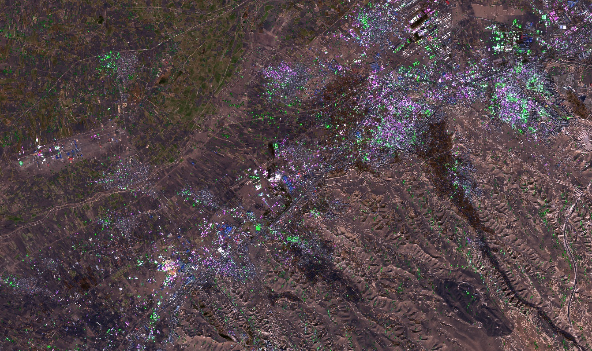
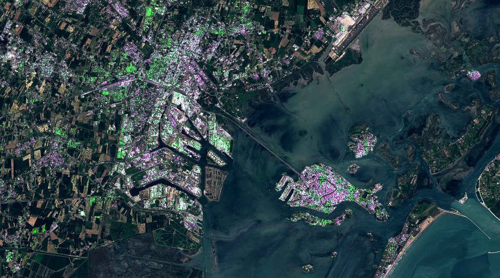

# Urban detection with Sentinel-1 and Sentinel-2
  
<a href="#" id='togglescript'>Show</a> script or [download](script.js){:target="_blank"} it.  

  
  
  
  
  

  

# Author: 
Monja B. Šebela
  
## Evaluate and visualize  
 - [EO Browser](https://apps.sentinel-hub.com/eo-browser/?zoom=12&lat=45.47023&lng=12.32477&themeId=URBAN-NORMAL-MODE&datasetId=S2L2A&fromTime=2019-12-10T00%3A00%3A00.000Z&toTime=2019-12-10T23%3A59%3A59.999Z&visualizationUrl=https%3A%2F%2Fservices.sentinel-hub.com%2Fogc%2Fwms%2Fbf6e668a-8214-44f3-9a3d-8ec3976d58c9&evalscript=Ly9WRVJTSU9OPTMKdmFyIHNldHVwID0gKCkgPT4gKHsKICBpbnB1dDogWwogICAge2RhdGFzb3VyY2U6ICJzMmwxYyIsIGJhbmRzOlsiQjAyIiwgIkIwMyIsICJCMDQiLCAiQjA4IiwgIkIxMSJdLCB1bml0czogIlJFRkxFQ1RBTkNFIiwgbW9zYWlja2luZzogIk9SQklUIn0sCiAgICB7ZGF0YXNvdXJjZTogInMxZ3JkIiwgYmFuZHM6WyJWViIsICJWSCJdLCB1bml0czogIlJFRkxFQ1RBTkNFIiwgbW9zYWlja2luZzogIk9SQklUIiwgb3J0aG9yZWN0aWZ5OiJUUlVFIn0sCiAgICB7ZGF0YXNvdXJjZTogInMybDJhIiwgYmFuZHM6WyJCMDIiLCAiQjAzIiwgIkIwNCJdLCB1bml0czogIlJFRkxFQ1RBTkNFIiwgbW9zYWlja2luZzogIk9SQklUIn0KICBdLAogIG91dHB1dDogWwogICAgeyBpZDogImRlZmF1bHQiLCBiYW5kczogMywgc2FtcGxlVHlwZTogU2FtcGxlVHlwZS5BVVRPIH0KICBdLAp9KQoKZnVuY3Rpb24gZXZhbHVhdGVQaXhlbChzYW1wbGVzLCBpbnB1dERhdGEsIGlucHV0TWV0YWRhdGEsIGN1c3RvbURhdGEsIG91dHB1dE1ldGFkYXRhKSB7CiB2YXIgUzJMMUMgPSBzYW1wbGVzLnMybDFjWzBdCiB2YXIgUzJMMkEgPSBzYW1wbGVzLnMybDJhWzBdCiB2YXIgUzEgPSBzYW1wbGVzLnMxZ3JkWzBdCiBsZXQgbmR2aSA9IChTMkwxQy5CMDggLSBTMkwxQy5CMDQpIC8gKFMyTDFDLkIwOCArIFMyTDFDLkIwNCkKIGxldCBuZG1pID0gKFMyTDFDLkIwOCAtIFMyTDFDLkIxMSkgLyAoUzJMMUMuQjA4ICsgUzJMMUMuQjExKQogCiAgIGlmIChuZHZpID4gMC41KSB7CiAgICByZXR1cm4gewogICAgICBkZWZhdWx0OiBbKDMqUzJMMkEuQjA0KSwgKDMqUzJMMkEuQjAzKSwgKDMqUzJMMkEuQjAyKV0KICAgIH19CiAgaWYgKG5kbWkgPiAwKSB7CiAgICByZXR1cm4gewogICAgICBkZWZhdWx0OiBbKDMqUzJMMkEuQjA0KSwgKDMqUzJMMkEuQjAzKSwgKDQqUzJMMkEuQjAyKV0KICAgIH0KIH0KICBpZiAoKFMxLlZIID4gMC4yKXx8KFMxLlZWID4gMC4yKSkgewogICAgcmV0dXJuIHsKICAgICAgZGVmYXVsdDogW1MxLlZIKjUuNSwgUzEuVlYsIFMxLlZIKjhdCiAgICB9fQogIAogIGxldCB2YWwgPSBbKDMqUzJMMUMuQjA0KS0wLjIsICgzKlMyTDFDLkIwMyktMC4yLCAoMypTMkwxQy5CMDIpLTAuMl07CiAgcmV0dXJuIHsKICAgIGRlZmF1bHQ6IHZhbAogIH0KfQ%3D%3D){:target="_blank"}
 When EO Browser loads, switch to **code view**, check the **Use additional datasets (advanced)** and **S-1 GRD**, and **S-2 L1C** boxes. Finnally press **Refresh**.
  
## General description of the script  
  
This script is based on the [Urban areas composite for Sentinel-1](https://custom-scripts.sentinel-hub.com/sentinel-1/urban_areas/). The script displayes highly reflective VV and VH pixels as built up, limiting them by using basic vegetation and water masking with Sentinel-2. It is prone to overestimation over high slope areas and barren rock. 

## Description of representative images  
  
**Tabriz, Iran**
 

**Venice, Italy**
  

