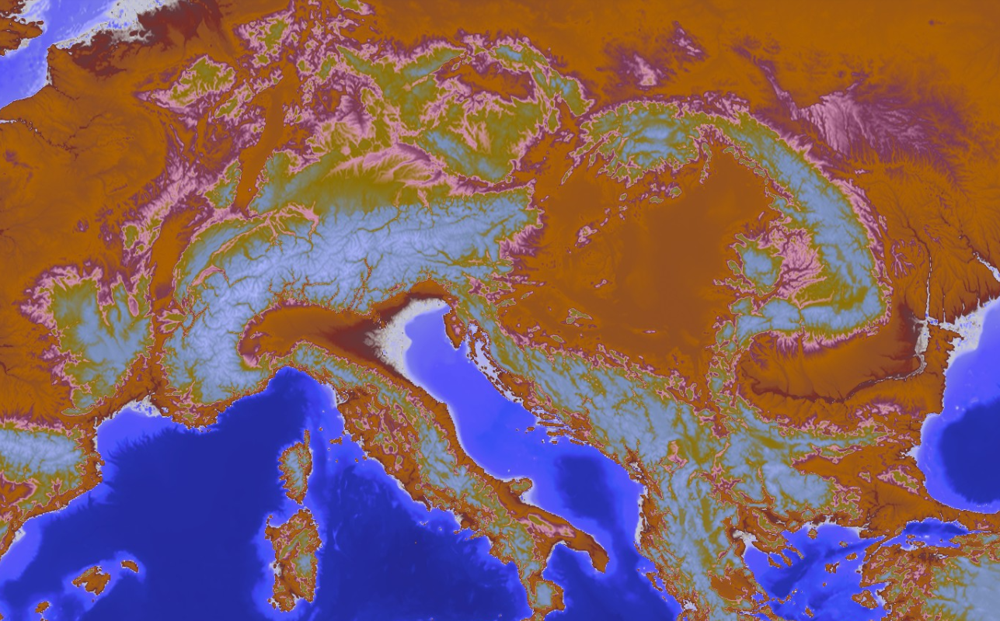

# DEM Color Visualization
<a href="#" id='togglescript'>Show</a> script or [download](script.js){:target="_blank"} it.


      


## Evaluate and visualize

- [Sentinel Playground](https://apps.sentinel-hub.com/sentinel-playground/?source=DEM&lat=45.79050946752472&lng=14.78759765625&zoom=6&preset=CUSTOM&layers=DEM,DEM,DEM&maxcc=20&gain=1.0&gamma=1.0&time=2019-05-01%7C2019-11-21&atmFilter=&showDates=false&evalscript=Ly9WRVJTSU9OPTMKcmV0dXJuIGNvbG9yQmxlbmQoREVNLCBbLTEyMDAwLC05MDAwLC02MDAwLC0xMDAwLC01MDAsLTIwMCwtNTAsLTIwLC0xMCwwLDEwLDMwLDUwLDIwMCwzMDAsNDAwLDUwMCwxMDAwLDMwMDAsNTAwMCw3MDAwLDkwMDBdLApbWzAuMDAwLCAwLjAwMCwgMC4xNTddLApbMC4xMTgsIDAuMDAwLCAwLjM1M10sClswLjExOCwgMC4xMTgsIDAuNDcxXSwKWzAuMTU3LCAwLjE5NiwgMC43MDZdLApbMC4yMzUsIDAuMjM1LCAwLjkwMl0sClswLjIzNSwgMC4zMTQsIDAuOTYxXSwKWzAuMzUzLCAwLjMzMywgMC45ODBdLApbMC40NzEsIDAuNDcxLCAwLjkyMl0sClswLjYyNywgMC42MjcsIDEuMDAwXSwKWzAuNzg0LCAwLjc4NCwgMC43ODRdLApbMC4zOTIsIDAuMjIwLCAwLjIzNV0sClswLjQ3MSwgMC4xODAsIDAuMTU3XSwKWzAuNTQ5LCAwLjI5OCwgMC4xNTddLApbMC42NjcsIDAuMzc2LCAwLjAwMF0sClswLjQ3MSwgMC4yMjAsIDAuMzUzXSwKWzAuODI0LCAwLjU3MywgMC43MDZdLApbMC41NDksIDAuNDMxLCAwLjAwMF0sClswLjQ3MSwgMC41NDksIDAuNzA2XSwKWzAuNjI3LCAwLjY2NywgMC45NDFdLApbMC43NDUsIDAuNzg0LCAwLjk4MF0sClswLjg2MywgMC45NDEsIDEuMDAwXSwKWzEuMDAwLCAxLjAwMCwgMS4wMDBdXSk%3D)

## Description

This script returns a color visualization of digital elevation model, using a colorBlend function, assigning continuous natural terrain colors to the elevation borders. 

 