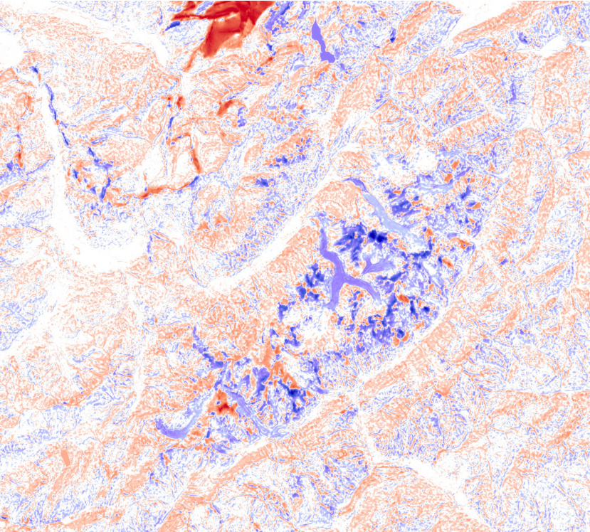
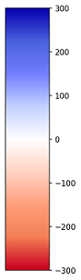

# Mapzen and Copernicus DEM difference Visualization
<a href="#" id='togglescript'>Show</a> script or [download](script.js){:target="_blank"} it.


      


## Description

Sentinel Hub supports **Mapzen DEM** and **Copernicus DEM**. **Mapzen DEM** is based on SRTM30 (Shuttle Radar Topography Mission) and [other sources](https://github.com/tilezen/joerd/blob/master/docs/data-sources.md). **Copernicus DEM** is based on WorldDEM that is infilled on a local basis with the following DEMs: ASTER, SRTM90, SRTM30, SRTM30plus, GMTED2010, TerraSAR-X Radargrammetric DEM, ALOS World 3D-30m. More information can be found in our [documentation](https://docs.sentinel-hub.com/api/latest/data/dem/).

This script returns a blue-white-red visualization of the difference (Mapzen DEM - Copernicus DEM) between **Mapzen DEM** and **Copernicus DEM**, and highlights where the most positive/negative values occur in your area of interest. Below is an example output showing the difference of **Mapzen DEM** and **Copernicus DEM** over the Alpine region around Mont Blanc.

## Color legend

A darker blue colour indicates larger positive differences of Mapzen DEM's values over Copernicus DEM's values, whereas a darker red colour indicates larger negative differences. All values greater/less than 300/-300 are mapped to 300/-300 for better visualization.

 
