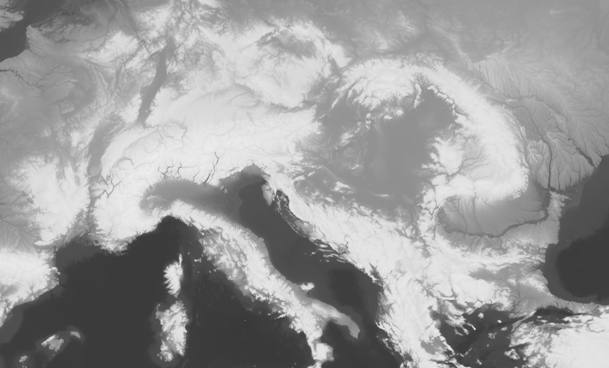

# DEM Grayscale Visualization
<a href="#" id='togglescript'>Show</a> script or [download](script.js){:target="_blank"} it.


      


## Evaluate and visualize

- [Sentinel Playground](https://apps.sentinel-hub.com/sentinel-playground/?source=DEM&lat=45.79050946752472&lng=14.78759765625&zoom=6&preset=CUSTOM&layers=DEM,DEM,DEM&maxcc=20&gain=1.0&gamma=1.0&time=2019-05-01%7C2019-11-21&atmFilter=&showDates=false&evalscript=Ly9WRVJTSU9OPTMKcmV0dXJuIGNvbG9yQmxlbmQoREVNLCBbLTEyMDAwLC05MDAwLC01MDAwLC0xMDAwLC01MDAsLTIwMCwtNTAsLTIwLC0xMCwwLDEwLDMwLDUwLDIwMCwzMDAsNDAwLDUwMCwxMDAwLDMwMDAsNTAwMCw3MDAwLDkwMDBdLCBbClswLjAwMCwgMC4wMDAsIDAuMDAwXSwKWzAuMDk4LCAwLjA5OCwgMC4wOThdLApbMC4yMTYsIDAuMjE2LCAwLjIxNl0sClswLjI0MywgMC4yNDMsIDAuMjQzXSwKWzAuMjc1LCAwLjI3NSwgMC4yNzVdLApbMC4yOTQsIDAuMjk0LCAwLjI5NF0sClswLjMxNCwgMC4zMTQsIDAuMzE0XSwKWzAuMzMzLCAwLjMzMywgMC4zMzNdLApbMC4zNTMsIDAuMzUzLCAwLjM1M10sClswLjM5MiwgMC4zOTIsIDAuMzkyXSwKWzAuNDMxLCAwLjQzMSwgMC40MzFdLApbMC41MTAsIDAuNTEwLCAwLjUxMF0sClswLjU0OSwgMC41NDksIDAuNTQ5XSwKWzAuNjI3LCAwLjYyNywgMC42MjddLApbMC43MDYsIDAuNzA2LCAwLjcwNl0sClswLjc4NCwgMC43ODQsIDAuNzg0XSwKWzAuODQzLCAwLjg0MywgMC44NDNdLApbMC44ODIsIDAuODgyLCAwLjg4Ml0sClswLjkyMiwgMC45MjIsIDAuOTIyXSwKWzAuOTYxLCAwLjk2MSwgMC45NjFdLApbMC45ODAsIDAuOTgwLCAwLjk4MF0sClsxLjAwMCwgMS4wMDAsIDEuMDAwXV0p)

## Description

This script returns a grayscale visualization of digital elevation model, using a colorBlend function, assigning continuous colors to the elevation borders. 

 