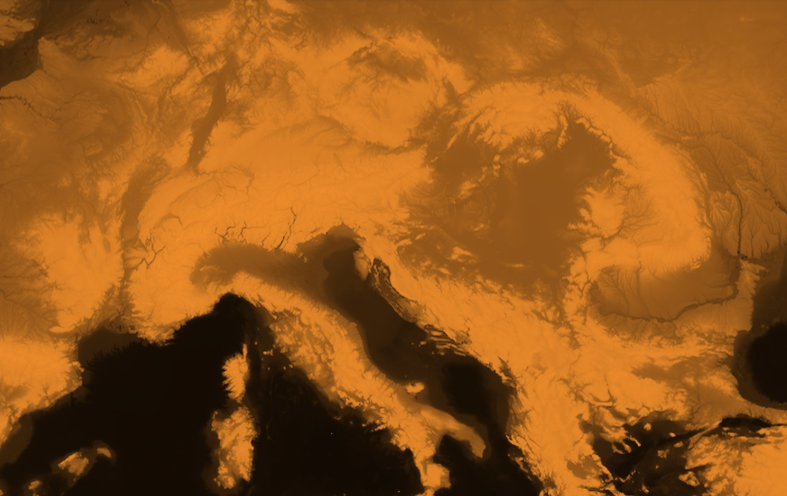

# DEM Sepia Visualization
<a href="#" id='togglescript'>Show</a> script or [download](script.js){:target="_blank"} it.


      


## Evaluate and visualize

- [Sentinel Playground](https://apps.sentinel-hub.com/sentinel-playground/?source=DEM&lat=45.79050946752472&lng=14.78759765625&zoom=6&preset=CUSTOM&layers=DEM,DEM,DEM&maxcc=20&gain=1.0&gamma=1.0&time=2019-05-01%7C2019-11-21&atmFilter=&showDates=false&evalscript=Ly9WRVJTSU9OPTMKcmV0dXJuIGNvbG9yQmxlbmQoREVNLCBbLTEyMDAwLC05MDAwLC01MDAwLC0xMDAwLC01MDAsLTIwMCwtNTAsLTIwLC0xMCwwLDEwLDMwLDUwLDIwMCwzMDAsNDAwLDUwMCwxMDAwLDMwMDAsNTAwMCw3MDAwLDkwMDBdLCBbClswLjAwMCwgMC4wMDAsIDAuMDAwXSwKWzAuMDIwLCAwLjAwOCwgMC4wMDBdLApbMC4wNTksIDAuMDMxLCAwLjAwOF0sClswLjA5OCwgMC4wNTUsIDAuMDE2XSwKWzAuMTM3LCAwLjA3OCwgMC4wMjRdLApbMC4xNzYsIDAuMTAyLCAwLjAzMV0sClswLjIzNSwgMC4xMzcsIDAuMDM5XSwKWzAuMzE0LCAwLjE4NCwgMC4wNTVdLApbMC4zNTMsIDAuMjA4LCAwLjA2M10sClswLjM5MiwgMC4yMjcsIDAuMDY3XSwKWzAuNDMxLCAwLjI1MSwgMC4wNzVdLApbMC41MTAsIDAuMjk4LCAwLjA5MF0sClswLjU0OSwgMC4zMjIsIDAuMDk4XSwKWzAuNjI3LCAwLjM2OSwgMC4xMTBdLApbMC43MDYsIDAuNDE2LCAwLjEyNV0sClswLjc4NCwgMC40NTksIDAuMTM3XSwKWzAuODQzLCAwLjQ5NCwgMC4xNDldLApbMC44ODIsIDAuNTE4LCAwLjE1N10sClswLjkyMiwgMC41NDEsIDAuMTYxXSwKWzAuOTYxLCAwLjU2NSwgMC4xNjldLApbMC45ODAsIDAuNTc2LCAwLjE3M10sClsxLjAwMCwgMC41ODgsIDAuMTc2XV0p)

## Description

This script returns a sepia visualization of digital elevation model, using a colorBlend function, assigning continuous colors to the elevation borders. 

 