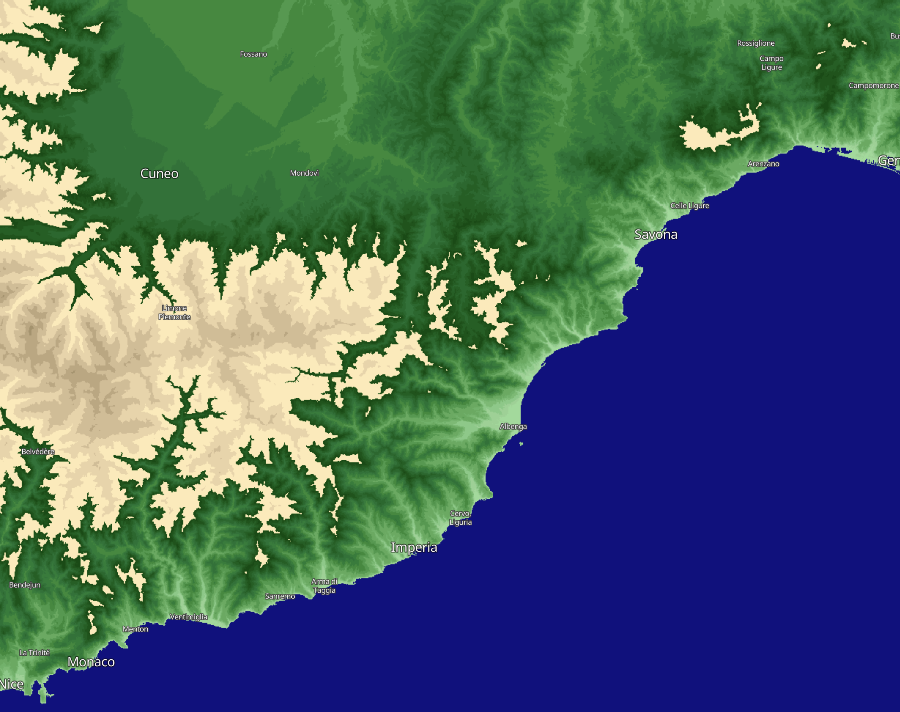

## Description

Sentinel Hub supports **Mapzen DEM** and **Copernicus DEM**. **Mapzen DEM** is based on SRTM30 (Shuttle Radar Topography Mission) and [other sources](https://github.com/tilezen/joerd/blob/master/docs/data-sources.md). **Copernicus DEM** is based on WorldDEM that is infilled on a local basis with the following DEMs: ASTER, SRTM90, SRTM30, SRTM30plus, GMTED2010, TerraSAR-X Radargrammetric DEM, ALOS World 3D-30m. More information can be found in our [documentation](https://docs.sentinel-hub.com/api/latest/data/dem/).

This script returns a visualisation with green colours representing lowland elevations and earth colours as mountainous elevations. The script uses discrete classes rather than the continuous visualisations in the other DEM evalscripts in this repository.

## Color table

<table>
  <tr>
    <th>Elevation range</th>
    <th>HTLM color code</th>
    <th>Color</th>
  </tr>
  <tr>
    <td>Below Sea Level</td>
    <td>#0f0f8c</td>
    <td style="background-color: #0f0f8c;"></td>
  </tr>
  <tr>
    <td>0-10m</td>
    <td>#175408</td>
    <td style="background-color: #175408;"></td>
  </tr>
  <tr>
    <td>10-25m</td>
    <td>#1f5e14</td>
    <td style="background-color: #1f5e14;"></td>
  </tr>
  <tr>
    <td>25-50m</td>
    <td>#266921</td>
    <td style="background-color: #266921;"></td>
  </tr>
  <tr>
    <td>50-75m</td>
    <td>#2e732e</td>
    <td style="background-color: #2e732e;"></td>
  </tr>
  <tr>
    <td>75-100m</td>
    <td>#367d3b</td>
    <td style="background-color: #367d3b;"></td>
  </tr>
  <tr>
    <td>100-200m</td>
    <td>#3d873d</td>
    <td style="background-color: #3d873d;"></td>
  </tr>
  <tr>
    <td>200-300m</td>
    <td>#4d9440</td>
    <td style="background-color: #4d9440;"></td>
  </tr>
  <tr>
    <td>300-400m</td>
    <td>#5ea354</td>
    <td style="background-color: #5ea354;"></td>
  </tr>
  <tr>
    <td>400-500m</td>
    <td>#73b366</td>
    <td style="background-color: #73b366;"></td>
  </tr>
  <tr>
    <td>500-600m</td>
    <td>#7aba70</td>
    <td style="background-color: #7aba70;"></td>
  </tr>
  <tr>
    <td>600-700m</td>
    <td>#85c27a</td>
    <td style="background-color: #85c27a;"></td>
  </tr>
  <tr>
    <td>700-800m</td>
    <td>#96cf8f</td>
    <td style="background-color: #96cf8f;"></td>
  </tr>
  <tr>
    <td>800-900m</td>
    <td>#a6d69c</td>
    <td style="background-color: #a6d69c;"></td>
  </tr>
  <tr>
    <td>900-1000m</td>
    <td>#abdea1</td>
    <td style="background-color: #abdea1;"></td>
  </tr>
  <tr>
    <td>1000-1500m</td>
    <td>#fcedbf</td>
    <td style="background-color: #fcedbf;"></td>
  </tr>
  <tr>
    <td>1500-2000m</td>
    <td>#ebd9b0</td>
    <td style="background-color: #ebd9b0;"></td>
  </tr>
  <tr>
    <td>2000-2500m</td>
    <td>#d6c49e</td>
    <td style="background-color: #d6c49e;"></td>
  </tr>
  <tr>
    <td>2500-3000m</td>
    <td>#c2b08a</td>
    <td style="background-color: #c2b08a;"></td>
  </tr>
  <tr>
    <td>3000-3500m</td>
    <td>#ad9c75</td>
    <td style="background-color: #ad9c75;"></td>
  </tr>
  <tr>
    <td>3500-4000m</td>
    <td>#998761</td>
    <td style="background-color: #998761;"></td>
  </tr>
  <tr>
    <td>4000-4500m</td>
    <td>#87734d</td>
    <td style="background-color: #87734d;"></td>
  </tr>
  <tr>
    <td>4500-5000m</td>
    <td>#736138</td>
    <td style="background-color: #736138;"></td>
  </tr>
  <tr>
    <td>5000-5500m</td>
    <td>#5e4d26</td>
    <td style="background-color: #5e4d26;"></td>
  </tr>
  <tr>
    <td>5500-6000m</td>
    <td>#4a3812</td>
    <td style="background-color: #4a3812;"></td>
  </tr>
  <tr>
    <td>6000-7000m</td>
    <td>#e6e6e6</td>
    <td style="background-color: #e6e6e6;"></td>
  </tr>
  <tr>
    <td>7000-8000m</td>
    <td>#f2f2f2</td>
    <td style="background-color: #f2f2f2;"></td>
  </tr>
  <tr>
    <td>8000m +</td>
    <td>#ffffff</td>
    <td style="background-color: #ffffff;"></td>
  </tr>
</table>
 
## Author of the script
 
William Ray
