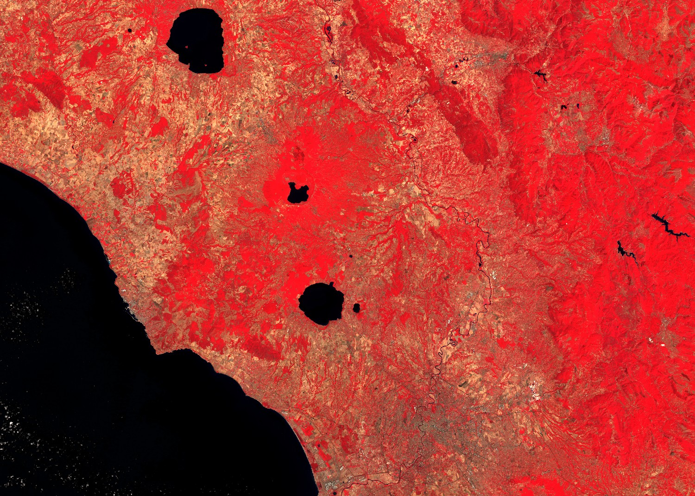

## Description

This is a simple RGB composite with NIR band in the red channel, red band in the green channel and green band in the blue channel. The script is useful for plant density and health monitoring, as vegetation (displayed in red) heavily reflects NIR light while absorbing red. Vegetation is colored red, cities and exposed ground are grey or tan, and water appears blue or black.

## Description of representative images

HLS false color composite of Rome. Acquired on 2022-07-24, processed by Sentinel Hub. 

