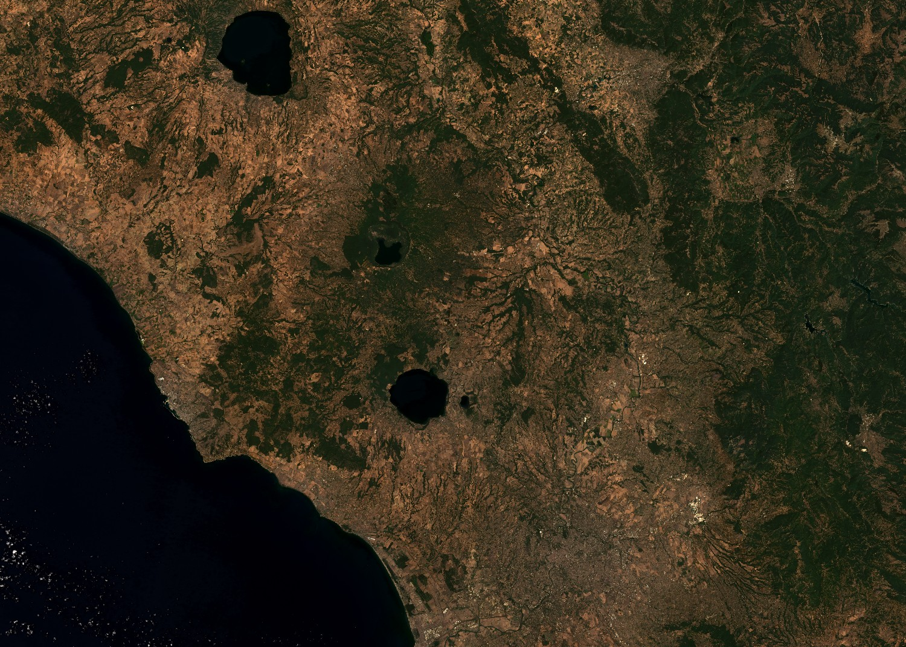

# True Color

<a href="#" id='togglescript'>Show</a> script or [download](script.js){:target="_blank"} it.


      


## Evaluate and visualize

- [EO Browser - To add](){:target="_blank"}

## Description

HLS true color composite uses visible light bands red, green and blue in the corresponding red, green and blue color channels, resulting in a natural colored product, that is a good representation of the Earth as humans would see it naturally. 

## Description of representative images

HLS true color composite of Rome. Acquired on 2022-07-24, processed by Sentinel Hub. 

