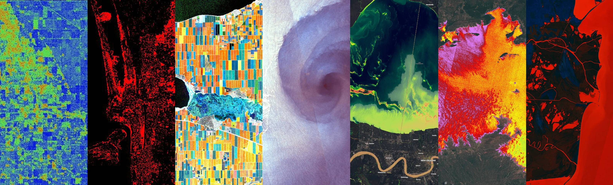

# Collection of custom scripts

---

This repository contains a collection of custom scripts for [Sentinel Hub](https://www.sentinel-hub.com/), which can be fed to the services via the URL.

Custom scripts are a piece of Javascript code, used to visualize satellite imagery and to control what values the Sentinel Hub services will return. Any visualization of any constellation (e.g. Sentinel-2 satellite), even a simple true color composite, is dictated by a custom script.

## Contribute

You are invited to publish your own scripts. For this see the section [Contribute](). See also the [documentation page](https://docs.sentinel-hub.com/api/latest/evalscript/) for custom scripts.

## Navigation

Navigate the webpage with the sidebar on the left. The sidebar provides custom scripts split up by satellite sensors.

Alternatively you can also use the search bar at the top to look for custom scripts that might be of interest to you (try typing in `fire` or `NDVI` for example).

## Relevant reading
* [Multi-temporal Processing](https://medium.com/sentinel-hub/multi-temporal-processing-6a80e5c84188)
* [Color Correction with JavaScript](https://medium.com/sentinel-hub/color-correction-with-javascript-d721e12a919) (by Miha Kadunc)
* [Multi-year time series of multi-spectral data viewed and analyzed in Sentinel Hub](https://medium.com/sentinel-hub/multi-year-time-series-of-multi-spectral-data-viewed-and-analyzed-in-sentinel-hub-5628ec4fad9c) (by Grega Milcinski)
* [The Use of Satellite Imagery in Crisis Management after Flooding](https://medium.com/sentinel-hub/the-use-of-satellite-imagery-in-crisis-management-after-flooding-382be517224f)
* [How to Create Cloudless Mosaics](https://medium.com/sentinel-hub/how-to-create-cloudless-mosaics-37910a2b8fa8)
* [Educational Role of EO Browser and New Features](https://medium.com/sentinel-hub/educational-role-of-eo-browser-and-new-features-5bc6ea8d8143) (by Sabina Dolenc)
* [Environmental Monitoring of Conflicts using Sentinel-2 data](https://medium.com/sentinel-hub/environmental-monitoring-of-conflicts-using-sentinel-2-61f07d76e27b) (by Wim Zwijnenburg)
* [Why Newsrooms need People with Expertise in Remote Sensing](https://medium.com/sentinel-hub/why-newsrooms-need-people-with-expertise-in-remote-sensing-a8e83cedda0a) (by Pierre Markuse)
* [Active Volcanoes as Seen from Space](https://medium.com/sentinel-hub/active-volcanoes-as-seen-from-space-9d1de0133733) (by Sabina Dolenc)
* [Get Creative and Solve a Remote Sensing Problem at Home from your PC and Win!](https://medium.com/sentinel-hub/get-creative-and-solve-a-remote-sensing-problem-at-home-from-your-pc-and-win-9353938d5fff) (by Grega Milcinski)
* [Measuring Air Pollution from Space](https://medium.com/sentinel-hub/measuring-air-pollution-from-space-7492f5dad7bc) (by Sabina Dolenc)
* [Mapping deforestation with Sentinel Hub](https://medium.com/sentinel-hub/mapping-deforestation-from-sentinel-hub-de6aae67f817) (by Nicolas Karasiak)
* [Why join the next Sentinel Hub Custom Script Contest](https://medium.com/sentinel-hub/why-to-join-the-next-sentinel-hub-custom-script-contest-f3adb6c8e92c) (by Sabina Dolenc)
* [Learning Custom Scripts to make Useful and Beautiful Satellite images](https://medium.com/sentinel-hub/create-useful-and-beautiful-satellite-images-with-custom-scripts-8ef0e6a474c6) (by Monja Šebela)
* [It’s a faaaake… — Or not?](https://medium.com/sentinel-hub/its-a-faaaake-or-not-bace4f0c01ec) (by Pierre Markuse)
* [Custom scripts: faster, cheaper, better!](https://medium.com/sentinel-hub/custom-scripts-faster-cheaper-better-83f73894658a) (by Monja Šebela)
* [Water Quality Information for Everyone](https://medium.com/sentinel-hub/water-quality-information-for-everyone-a81faab8ff5e)
* [New Themes, Multi-Temporal Scripting and Other Improvements in EO Browser](https://medium.com/sentinel-hub/new-themes-multi-temporal-scripting-and-other-improvements-in-eo-browser-725267d09f2f) (by Monja Šebela)
