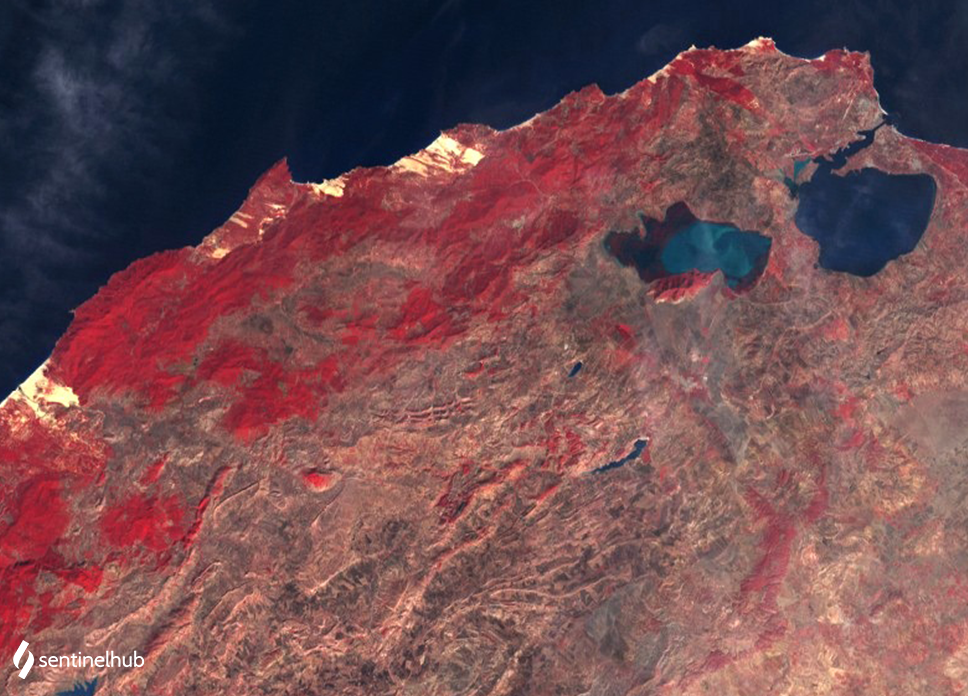

## Evaluate and Visualize

- [EO Browser](https://sentinelshare.page.link/gP7E)

## General description of the script

This is a simple RGB composite with NIR band B04 (800 - 1100 nm) in the red channel, red band B02 in the green channel and green band B01 in the blue channel. The script is useful for plant density and health monitoring, as vegetation (displayed in red) heavily reflects NIR light while absorbing red. The band 4 also penetrates atmospheric haze, and distinguishes between land and water. Cities and exposed ground are grey or tan, and water appears blue or black. 

## Description of representative images

The False Color NIR Composite in northern Tunisia. Acquired on 1987-10-15.

## References

[4] [LANDSAT 5 (MSS) IMAGERY. Earth Observation System](https://eos.com/find-satellite/landsat-5-mss/){:target="_blank"}
