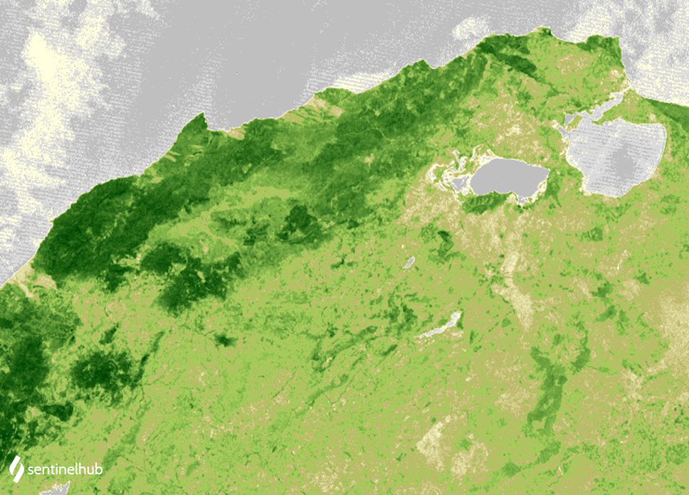

# Landsat 1-5 MSS NDVI

<a href="#" id='togglescript'>Show</a> script or [download](script.js){:target="_blank"} it.


      


## Evaluate and Visualize

- [EO Browser](https://sentinelshare.page.link/hsVm)

## General description of the script

The well known and widely used NDVI is a simple, but effective index for quantifying green vegetation. It normalizes green leaf scattering in Near Infra-red wavelengths with chlorophyll absorption in red wavelengths.

The value range of the NDVI is -1 to 1. Negative values of NDVI (values approaching -1) correspond to water. Values close to zero (-0.1 to 0.1) generally correspond to barren areas of rock, sand, or snow. Low, positive values represent shrub and grassland (approximately 0.2 to 0.4), while high values indicate temperate and tropical rainforests (values approaching 1). It is a good proxy for live green vegetation; see [1] for details.

The normalized difference vegetation index, abbreviated NDVI, is defined as

**NDVI = (NIR - RED) / (NIR + RED)**

For Landsat 1-5 MSS, the index looks like this:

**NDVI = (B04 - B02) / (B04 + B02)**

See also [this page](https://custom-scripts.sentinel-hub.com/sentinel-2/ndwi/#).

## Description of representative images

NDVI over northern Tunisia. Acquired on 1987-10-15.

