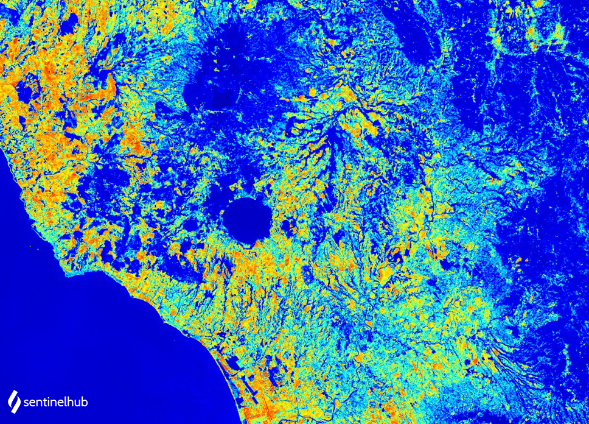

## Evaluate and Visualize

- [EO Browser](https://sentinelshare.page.link/Hebt)

## General description of the script

The NDMI is a normalized difference moisture index, that uses NIR and SWIR bands to display moisture. The SWIR band reflects changes in both the vegetation water content and the spongy mesophyll structure in vegetation canopies, while the NIR reflectance is affected by leaf internal structure and leaf dry matter content but not by water content. The combination of the NIR with the SWIR removes variations induced by leaf internal structure and leaf dry matter content, improving the accuracy in retrieving the vegetation water content. The amount of water available in the internal leaf structure largely controls the spectral reflectance in the SWIR interval of the electromagnetic spectrum. SWIR reflectance is therefore negatively related to leaf water content. In short, NDMI is used to monitor changes in water content of leaves, and was proposed by Gao. NDWI is computed using the near infrared (NIR) and the short wave infrared (SWIR) reflectance’s:

**NDMI = (NIR - SWIR) / (NIR + SWIR)**

For Landsat 8, NDMI calculates as: 

**NDMI = (B04 - B05) / (B04 + B05)**

See also [this page](https://custom-scripts.sentinel-hub.com/sentinel-2/ndmi/). 

## Description of representative images

The NDMI over Rome. Acquired on 2020-07-30.

