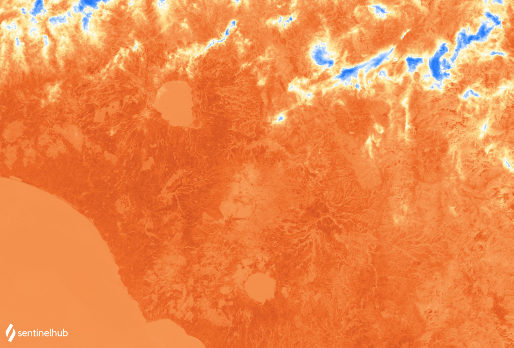

# Landsat 4-5 TM Thermal Visualization
<a href="#" id='togglescript'>Show</a> script or [download](script.js){:target="_blank"} it.


      


## Evaluate and visualize

- [EO Browser](https://sentinelshare.page.link/VMYw){:target="_blank"}   

## Description

This thermal visualization is based on band 6. At the central wavelength of 11040 nm it measures in the thermal infrared, or TIR. Instead of measuring the temperature of the air, like weather stations do, band 6 reports on the ground itself, which is often much hotter. Thermal band 10 is useful in providing surface temperatures and is collected with a 120-meter resolution, resampled to 30 meterss.

## Description of representative images

Landsat 4-5 TM thermal visualization of Rome. Acquired on 2011-11-11, processed by Sentinel Hub. 

 