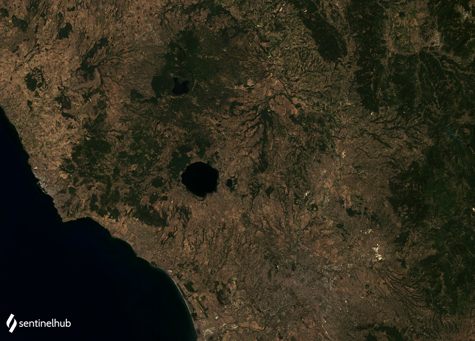

# Landsat 4-5 TM True Color

<button class="btn btn-primary" id="toggle-script" onclick="toggleScript()">Show Script</button>
[Download Script](script.js){: .btn target="_blank" download="{{paths | append: ".js"}}"}
{: .mt-lg-4 }

 




## Evaluate and visualize

- [EO Browser](https://sentinelshare.page.link/eds1){:target="_blank"}   

## Description

Landsat 8 true color composite uses visible light bands red (B04), green (B03) and blue (B02) in the corresponding red, green and blue color channels, resulting in a natural colored product, that is a good representation of the Earth as humans would see it naturally. 

## Description of representative images

True color image of Rome. Acquired on 2011-11-11, processed by Sentinel Hub. 

## References

-  [Landsat 8 bands](https://landsat.gsfc.nasa.gov/landsat-8/landsat-8-bands)
 