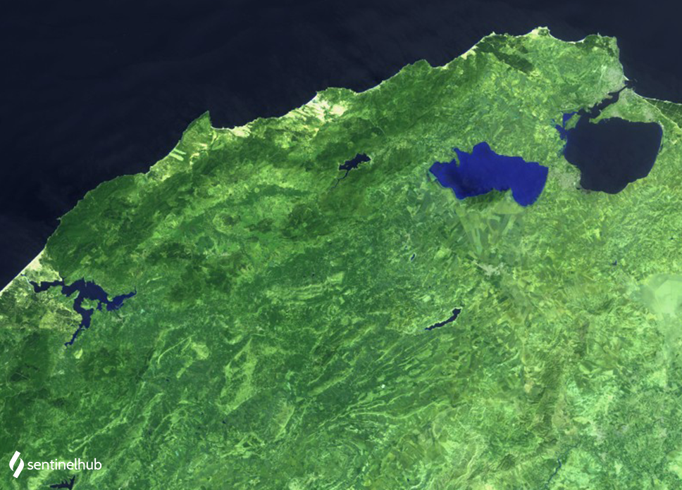

# Landsat 7 ETM+ SWIR Composite

<a href="#" id='togglescript'>Show</a> script or [download](script.js){:target="_blank"} it.


      


## General description of the script
Short wave infrared (SWIR) measurements can help scientists estimate how much water is present in plants and soil, as water absorbs SWIR wavelengths. Short wave infrared bands (a band is a region of the electromagnetic spectrum; a satellite sensor can image Earth in different bands) are also useful for distinguishing between cloud types (water clouds versus ice clouds), snow and ice, all of which appear white in visible light. In this composite vegetation appears in shades of green, soils and built-up areas are in various shades of brown, and water appears black. Newly burned land reflects strongly in SWIR bands, making them valuable for mapping fire damages. Each rock type reflects shortwave infrared light differently, making it possible to map out geology by comparing reflected SWIR light.

The composite:
**return [2.5 * B07, 2.5 * B05, 2.5 * B04]**

## Description of representative images

SWIR composite over northern Tunisia. Acquired on 2002-06-18.

