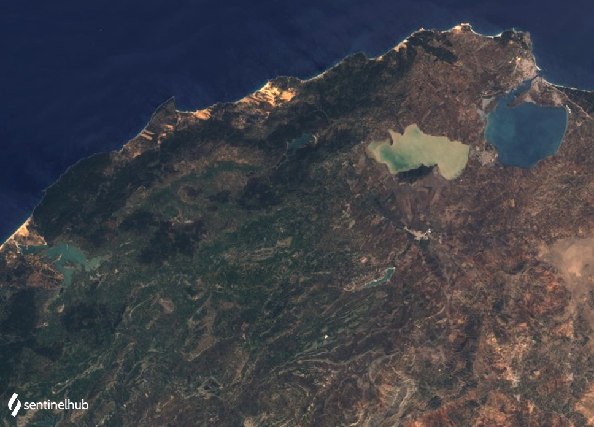

# Landsat 7 ETM+ True Color Composite

<a href="#" id='togglescript'>Show</a> script or [download](script.js){:target="_blank"} it.


      


## General description

The true color product maps Landsat 1-5 MSS band values B03, B02, and B01 which roughly correspond to red, green, and blue part of the spectrum, respectively, to R, G, and B components. The result is a true color product, that is a good representation of the Earth as humans would see it naturally.

## Description of representative images

True color over northern Tunisia. Acquired on 2002-06-18.

## References
 - Wikipedia, [True color](https://en.wikipedia.org/wiki/False_color#True_color). Accessed October 10th 2017.

