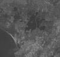
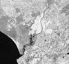
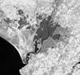
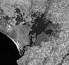
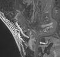

# Landsat 5 and 7 Bands

 - [Refference](https://landsat.gsfc.nasa.gov/landsat-8/landsat-8-bands/}

## Band 1

### B01 (Ultra Blue)

- Resolution = 30 m/px
- Bandwidth = 0.433–0.453 µm

Use: senses deep blues and violets. Blue light is hard to collect from space because it’s scattered easily by tiny bits of dust and water in the air, and even by air molecules themselves. This is one reason why very distant things (like mountains on the horizon) appear blueish, and why the sky is blue. Just as we see a lot of hazy blue when we look up at space on a sunny day, Landsat 8 sees the sky below it when it looks down at us through the same air. That part of the spectrum is hard to collect with enough sensitivity to be useful, and Band 1 is the only instrument of its kind producing open data at this resolution – one of many things that make this satellite special. It’s also called the coastal/aerosol band, after its two main uses: imaging shallow water, and tracking fine particles like dust and smoke (source).

Custom script: **return [B01];**

## Band 2

### B02 (Blue )

- Resolution = 30 m/px
- Bandwidth = 0.450–0.515 µm

Use: scattered by the atmosphere and illuminates material in shadows better than longer wavelengths; penetrates clear water better than other colors; absorbed by chlorophyll, so plants don’t show up very brightly in this band; useful for soil/vegetation discrimination, forest type mapping, and identifying man-made features.

Custom script: **return [B02];**

## Band 3

### B03 (Green )

- Resolution = 30 m/px
- Bandwidth = 0.525–0.600 µm

Use: penetrates clear water fairly well, gives excellent contrast between clear and turbid (muddy) water; helps find oil on the surface of water, and vegetation (plant life); reflects more green light than any other visible color; man-made features are still visible.

Custom script: **return [B03];**

## Band 4

### B04 (Red )

- Resolution = 30 m/px
- Bandwidth = 0.630–0.680 µm

Use: limited water penetration; reflects well from dead foliage, but not well from live foliage with chlorophyll; useful for identifying vegetation types, soils, and urban (city and town) features.

Custom script: **return [B04];**

## Band 5

### B05 (NIR)

- Resolution = 30 m/px
- Bandwidth = 0.845–0.885 µm

Use: measures the near infrared, or NIR. This part of the spectrum is especially important for ecology because healthy plants reflect it – the water in their leaves scatters the wavelengths back into the sky. By comparing it with other bands, we get indexes like NDVI, which let us measure plant health more precisely than if we only looked at visible greenness.

Custom script: **return [B05];**

## Bands 6 and 7

### B06 and B07 (SWIR)

- Resolution = 60 / 120 m/px*
- Bandwidth B06 = 1.560–1.660 µm
- Bandwidth B07 = 2.100–2.300 µm

Use: cover different slices of the shortwave infrared, or SWIR. They are particularly useful for telling wet earth from dry earth, and for geology: rocks and soils that look similar in other bands often have strong contrasts in SWIR.

Custom script: **return [B06];**

Band 6

Band 7

## Band 8

### B08 (Panchromatic - “pan”)

- Resolution = 15 m/px
- Bandwidth = 0.500–0.680 µm

Use: is the panchromatic – or just pan – band. It works just like black and white film: instead of collecting visibile colors separately, it combines them into one channel. Because this sensor can see more light at once, it’s the sharpest of all the bands, with a resolution of 15 meters (50 feet).

Custom script: **return [B08];**

## Band 9

### B09 (Cirrus)

- Resolution = 15 m/px
- Bandwidth = 0.500–0.680 µm

Use: is the panchromatic – or just pan – band. It works just like black and white film: instead of collecting visibile colors separately, it combines them into one channel. Because this sensor can see more light at once, it’s the sharpest of all the bands, with a resolution of 15 meters (50 feet).

Custom script: **return [B08];**

## Bands 10 and 11

### B10 and B11 (TIRS)

- Resolution = 100 m/px
- Bandwidth B10 = 10.6-11.2 µm
- Bandwidth B11 = 11.5-12.5 µm

Use: are in the thermal infrared, or TIR – they see heat. Instead of measuring the temperature of the air, like weather stations do, they report on the ground itself, which is often much hotter.

Custom script: **return [B10];**

